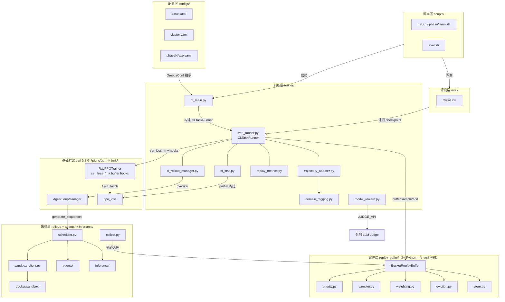

# CLAUDE.md

This file provides guidance to Claude Code (claude.ai/code) when working with code in this repository.

## 仓库性质

Continual Learning over Agentic LLM 的训练项目。仓库所有者：@孙豪。

- **设计文档**：全部位于 `doc/`，是项目的需求与设计依据
- **代码骨架**：`replay_buffer/`、`trainer/`、`rollout/`、`configs/`、`eval/`、`docker/sandbox/`、`scripts/`、`tests/`
- **训练框架**：[verl](https://github.com/volcengine/verl) `0.8.0`（pip 安装，不 fork，详见 `doc/source/训练与推理流程.md`）

### 当前阶段（交接背景，必读）

代码已全部写完，CPU 本机跑通 **~290 单测**（`pytest` 全收 295，288 passed + 7 skipped；skip 全是 `verl not installed` / `no CUDA device`，即本机没装 verl 也没 GPU）。唯一需要多卡 verl 的是 `@pytest.mark.gpu` 标记的全栈 smoke（`tests/test_verl_smoke.py` + `tests/test_buffer_hooks_smoke.py`）。**唯一阻塞是 64 卡集群 + 真实 Qwen3.6-27B 权重 + 数据**——全栈训练只能在多卡机器上做。

跨机器 / 跨 session 接手时的权威顺序：

1. **`doc/ops/Migration_64GPU.md`** — 交接文档，冷启动步骤
2. **`doc/archive/Progress.md`** — 交付状态单一来源（里程碑、模块完成度、阻塞）
3. **`doc/archive/Plan_训练链路补齐.md`** — 64 卡正式训练前残缺模块的施工规格（Gap A–H）
4. **`doc/archive/RunLog.md`** — append-only 运行记录

> **硬性规则**：任何可判定结果的动作（smoke / 训练 / 评测 / bug 复现与修复）都必须追加到 `doc/debug/Bug_Fix_精简总表.md`（bug 排障结论，按 A–G 类别归并）或对应调试文档，成功与失败都保留，**禁止删改历史条目**——失败是调试与论文的证据。

## 开发命令

```bash
# 安装（含开发依赖）
pip install -e ".[dev]"

# 运行所有测试
pytest

# 运行单个测试文件 / 单个测试函数
pytest tests/test_bucket.py
pytest tests/test_bucket.py::test_quota_allocation -v

# Lint（ruff）
ruff check .
ruff check --fix .          # 自动修复

# 格式化（black）
black .
black --check .             # 仅检查，不修改

# 类型检查
mypy replay_buffer/ trainer/

# 训练（单实验）
bash scripts/train.sh configs/phase1/b1.yaml
bash scripts/train.sh configs/phase3/r4.yaml --resume-from ckpts/r4-step-50

# 训练（整个 phase）
bash scripts/phase3/run.sh
bash scripts/phase3/run.sh --only r4    # phase 内单个实验

# 评测
bash scripts/eval.sh ckpts/b1-step-100

# 训练入口也可直接调用
python -m trainer.cl_main --config configs/phase1/b1.yaml

# 沙箱 / 采样链路（无 GPU 也可跑，用 --backend local）
python scripts/sandbox_smoke.py --backend local   # execute + M 采样 + winner 固化 + domain→bucket
bash docker/sandbox/ops/ops.sh query              # 查询腾讯沙箱 Tool / Instance
bash scripts/validate_sandbox_dockerfile.sh       # 校验镜像 Dockerfile 快照约束
```

> **凭证加载**：训练前 `source scripts/load_training_env.sh`（读 gitignored `.env`，校验 `SWANLAB_API_KEY`）；沙箱前 `source scripts/load_tencent_env.sh`（读 `docker/sandbox/{tencent,image,runtime}.env`）。`scripts/train.sh` 已自动 source 训练 env，直接调用脚本可省。所有凭证文件均在 `.gitignore`，从不在代码里硬编码。

> ⚠️ 测试分两类：默认全套 ~290 个 CPU 单测（本机无 verl/GPU 时 288 passed + 7 skipped）；`@pytest.mark.gpu` 标记的全栈 smoke（`tests/test_verl_smoke.py`、`tests/test_buffer_hooks_smoke.py`）需多卡 verl，本机 skip。沙箱真实后端（腾讯云北京区，`X-Access-Token`）需账号凭证；无凭证用 `--backend local`。

## 代码架构

模块依赖概览（mermaid 流程图，箭头方向 = 依赖/数据流向）：



- 箭头方向：**数据/控制流方向**。例如 `trainer/ → verl/` 表示 trainer 注入 loss 和 hooks 到 verl 框架中。
- `replay_buffer/` 标注"与 verl 解耦"——纯 Python 模块，不 import verl、不依赖 Ray，可在 CPU 单机上独立单测。
- `rollout/`、`agents/`、`inference/` 同样与 verl 解耦（`model_reward.py` 除外），依赖 E2B 腾讯沙箱做工具执行。
- 配置采用三层继承：`base.yaml → cluster.yaml → phaseN/exp.yaml`（或 `run/exp.yaml`），OmegaConf 合并。
- `skills/` — 可复用方法与工程规范（5 篇，见下表）。
- **接口怎么用 / observer 报告与声明怎么消费 → 先读 [`doc/ops/sandbox/接口使用_Sandbox与三Agent.md`](ops/sandbox/接口使用_Sandbox与三Agent.md)**：每个接口在哪、签名、谁产出谁消费——Sandbox 后端（`SandboxClient` 契约 + `make_sandbox`/`register_backend` 注册表，换/加厂商零改调用方）、三 Agent 的 `ObservationReport`（**报告**）/`actor_claims`（**声明**）/`Questioner`/`score_followup`，以及"claim-driven → 沙箱 API diff-driven"取证设计（§3）。**改这些接口或用这些报告/声明前必读。**

**奖励 = 外部冻结 LLM judge，不用规则奖励**：单个冻结 judge 对每条轨迹按统一尺度打分（抗 reward hacking、覆盖语义桶）。`custom_reward_function` 指向 `trainer/model_reward.py::compute_score`，judge 模型不写死、由 env 解析（`JUDGE_API_BASE` / `JUDGE_MODEL`，用 `scripts/serve_reward_model.sh` 本地 serve）。`reward_model.enable` 仍为 false——因为 judge 走**外部 serve**，不是 verl 内置 RM worker。规则 reward（旧 `rule_reward.py`）已废弃删除。

## 编码规范

- Python ≥ 3.10，ruff line-length=110，black line-length=110
- ruff 启用规则：E, F, W, I (isort), B (bugbear), UP (pyupgrade)；`E501` 忽略（line-length 由 black 管）
- 训练配置用 OmegaConf/yaml（非 argparse dataclass），实验 yaml 继承 `configs/base.yaml`，通过 `defaults: [../base]` 合并（解析在 `trainer/cl_main.py:load_config`）
- `bin/` 下是独立的一次性数据管道工具（tab 缩进、自有风格），**ruff/black 已 `extend-exclude` 排除**——不要套项目规范，也别把它们当可 import 的库。`data/`（含 `cleaning.py`、mock 数据、采集样本）同样被 `.gitignore` 排除，是运行时产物不是源码。

## 目录结构

```
agentic_cl_research/
├── CLAUDE.md                # 本文件，AI 协作指南
├── README.md                # 项目入口
├── pyproject.toml           # 项目元数据与依赖（src-layout：src/ + agents/ 双根）
├── doc/                     # 设计文档（详见下表）
├── paper/                   # 论文产出：drafts/(md 草稿) latex/ assets/ refs/
├── src/                     # ★ 6 个库包（PYTHONPATH 含 src/；包名不变，import 照旧）
│   ├── trainer/             #   CL Loss + 训练入口 + verl runner（基于 verl，零源码改动）
│   ├── replay_buffer/       #   9 桶 Buffer（纯 Python，与 verl 解耦）
│   ├── rollout/             #   采样侧：沙箱客户端 / 会话池 / 轨迹采集 / simulated_session 驱动
│   ├── inference/           #   单步生成边界（VerlRolloutGenerateFn / HTTP）
│   ├── eval/                #   ClawEval 评测
│   └── rewardmodel_choose/  #   reward 模型选型 sweep（一次性分析）
├── agents/                  # UserSim 三 agent：observer / questioner / reward(judge) + personas（仍在根，import agents.*）
├── configs/                 # 实验配置（按 phase 分子目录）
│   ├── base.yaml            #   共享默认配置
│   ├── cluster.yaml         #   集群 64 卡引擎层 overlay
│   ├── _generated_ppo_trainer.yaml  # verl 全量默认（集群 Hydra defaults 基底）
│   ├── exps/                #   agent_loop_config.yaml + hermes.config.yaml（原 exps/，凭证走 ${oc.env}）
│   ├── run/                 #   集群可运行配置（base + cluster + 实验语义）
│   ├── phase1/              #   B1
│   ├── phase2/              #   K1-K5, K2-R
│   ├── phase3/              #   R0, R3-R6, R4-w, R4-K
│   ├── phase4/              #   C1-C4
│   ├── phase5/              #   S1, S2
│   └── phase6/              #   X* (按需)
├── datasources/            # 原始数据（原 data/：taskspecs / labeled / cleaning.py），gitignored
├── datasets/               # 训练用 parquet（train_cl / train_exp2 等）
├── bin/                     # 独立数据管道工具（clean_zerowidth / detact / pipeline_cpp），ruff/black 排除
├── scripts/                 # 训练 / 评测 / 沙箱 / 采集脚本（仍在根，非库包）
│   ├── train.sh             #   通用单实验入口（自动 source 训练 env）
│   ├── run_cl.sh            #   CL 分阶段实验入口（train/eval/stage1/stage2）
│   ├── phaseN/run.sh        #   启动某 Phase 全部实验 (--only 选单个)
│   └── ...                  #   sandbox_smoke / serve_reward_model / collect_cold 等
├── tests/                   # ~290 单元测试 + verl 兼容性 smoke
│
│ ─── 运行时产物（gitignored）───
├── ckpts/                   # 训练 checkpoint 输出
│   └── <实验名>-step-<N>/
├── buffer_dumps/            # Replay Buffer 序列化快照
├── logs/                    # 训练日志
├── wandb/                   # W&B 实验追踪本地目录
└── eval/results/            # 评测输出结果
```

> **src-layout（2026-08-21）**：`replay_buffer/trainer/rollout/inference/eval/rewardmodel_choose` 从仓库根移入 `src/`；`agents/`、`scripts/`、`datasources/` 仍在根。包名未变，`import trainer.xxx` 等照旧——靠 `PYTHONPATH` 同时含 `src/` 和仓库根（`scripts/*.sh` 已设，pytest `pythonpath=["src","."]`）。config 里的文件路径（`path: src/trainer/model_reward.py`、`.../src/trainer/cl_agent_dataset.py`）已同步。

### 模型存放约定

| 类别 | 存放位置 | 说明 |
|------|----------|------|
| **预训练基底模型** | 仓库外，绝对路径引用 | **基座 = Qwen3.6-27B**（HF: `Qwen/Qwen3.6-27B`）。本地缓存路径如 `/mnt/afs/models/qwen3.6-27b/` 或 HuggingFace cache `~/.cache/huggingface/`。已在 `configs/base.yaml` 的 `model.name` / `model.tokenizer` 中默认指定 |
| **参考策略 $\pi_{ref}$** | `ckpts/` 或仓库外 | `actor_rollout_ref.ref.path` 指定。$\pi_0$ 可指向基底模型路径，$\pi_{t-1}$ 指向上一阶段的 ckpt |
| **训练 checkpoint** | `ckpts/<实验名>-step-<N>/` | trainer 自动写入，`save_freq=25` step 保存一次 |
| **Buffer 快照** | `buffer_dumps/` | 可选持久化，训练中断后可恢复 buffer 状态 |

> 所有运行时产物均已在 `.gitignore` 中排除，不要提交到 git。

## 文档结构与关系

所有设计文档位于 `doc/`（索引见 [`doc/README.md`](doc/README.md)），按子目录分类：

**① source/ — 信源（论文与代码的上游依据，长期维护）**

| 文件 | 内容 |
|------|------|
| `doc/source/CL_Design.md` | **主文档**：CL Loss / Replay Buffer（9桶+quota+priority+冷启动数据需求）/ 实验路线 / 评测 / GPU / 精度 / 文献 |
| `doc/source/BucketAlgorithm.md` | **9 桶 Buffer 算法单一规范**：quota / priority / 两级采样 / 淘汰 / 持久化 |
| `doc/source/usersim.md` | **UserSim 单一信源**：模型选型 + 三 agent 架构（observer/questioner/reward）+ 多轮 query 在线生成 + 42 人设表 |
| `doc/source/训练与推理流程.md` | 训练循环 + 推理全链路 + verl 0.8.0 集成（不 fork，外挂注入）+ 数据 pipeline |
| `doc/source/ClawEval_Metadata.md` | 评测基准数据 |
| `doc/source/Agent轨迹_Schema.md` | Agent 轨迹 schema（现状 mock vs 目标 buffer/训练） |
| `doc/source/Hermes_Subagent_训练数据方案.md` | Hermes 同步出入栈 + OpenClaw 主子各自训练方案 |

**② ops/ — 运行手册（操作向，按需查阅）**

| 文件 | 内容 |
|------|------|
| `doc/ops/Migration_64GPU.md` | 跨机器交接 + 冷启动步骤 + 集群提交快速参考（附录） |
| `doc/ops/sandbox/Sandbox_概念与术语.md` | **沙箱入口**：镜像/Tool/Instance + TCR/CCR + API 对照 + 代码执行 + 真实规格 |
| `doc/ops/sandbox/Sandbox_冒烟指南.md` | **沙箱操作唯一入口**：冒烟步骤 + 命令速查 + custom 镜像 build + 常见卡点 |
| `doc/ops/sandbox/Sandbox_Agent架构.md` | 动作内/推理外 + OpenClaw |
| `doc/ops/sandbox/Sandbox_管理调度指南.md` | 16×8 winner-sync 调度 |
| `doc/ops/sandbox/接口使用_Sandbox与三Agent.md` | **接口怎么用速查**：Sandbox 后端（`SandboxClient`/registry）+ 三 Agent 报告(`ObservationReport`)/声明(`actor_claims`)；含 claim→diff 驱动设计 |
| `doc/ops/sandbox/ColdRollout_采集.md` | 冷启动采集运行手册 |
| `doc/ops/sandbox/沙箱_Dockerfile制作方案.md` | 沙箱镜像 Dockerfile 制作方案 |

**③ eval/ — 评测**

| 文件 | 内容 |
|------|------|
| `doc/eval/防遗忘评测方案.md` | 防遗忘评测方案：按桶分组训练 + 统一评测 + 权重后置 |

**④ debug/ — 训练排障**（结论已并入 `Bug_Fix_精简总表.md`，逐条历程见源文件）

**⑤ weekly_report/ — 周报**（追加）

**⑥ archive/ — 归档（冗余/过期/已合并，不再维护）**

含过程记录（Progress.md / RunLog.md / BugLog_集群采集.md）、一次性技术报告副本、已合并的启动指南/操作手册/踩坑记录、过期待办、已完成的施工图等 26 篇，详见 `doc/README.md`。

> 论文产出在 `paper/`（`drafts/` 中英 Intro/Method + 总览、`latex/`、`assets/`、`refs/`）。一次性技术报告和复盘文档归档在 `paper/refs/`。

阅读顺序建议：接手先读 `doc/ops/Migration_64GPU.md` → `doc/archive/Progress.md`；理解设计读 `doc/source/CL_Design.md`（技术细节）→ `doc/source/BucketAlgorithm.md`（分桶论证）→ `doc/source/ClawEval_Metadata.md`（评测数据）→ `doc/source/训练与推理流程.md`（落地工程）。

## 可复用方法（skills/）

实现中提炼的跨实验/跨项目规范，改相关模块前先看对应 skill：

| Skill | 主题 |
|-------|------|
| `nine-bucket-replay-buffer.md` | 9 桶 Buffer（quota / priority / 两级采样 / 淘汰 / 持久化） |
| `verl-noninvasive-loss-injection.md` | verl 无侵入 loss 注入（不 fork，`set_loss_fn` + hooks，含 fully-async） |
| `cl-loss-zero-coefficient-shortcircuit.md` | CL Loss 组合实现与零系数端到端短路 |
| `experiment-yaml-conventions.md` | 实验 yaml 规范（OmegaConf 继承 + verl Hydra key path + 全量校验） |
| `claweval-forgetting-metrics.md` | ClawEval 评测与遗忘度量（manifest 接口 / Pass^N / CL Score） |

## 核心设计要点

### CL Loss

$$L_{cl} = \lambda_1 L_{rl} + \lambda_2 L_{kl} + \lambda_3 L_{replay} + \lambda_4 L_{ent}$$

- $L_{reg}$（参数 L2 正则）**弃用**，权重为 0，槽位让给 $L_{ent}$
- $\lambda_4 = 0.001$ **所有 Phase 固定开启**，防 Echo Trap，不参与 ablation
- $L_{kl}$ 用 reverse KL：$D_{KL}(\pi_{new} \| \pi_{ref})$

### Replay Buffer 9 桶结构

桶按**能力/领域**划分，不按难度划分（难度会随模型能力漂移）。桶体系（2026-07-04）= ClawEval 官方 category 合并（去多模态、单层无子桶），定义与映射见 `runs/_analysis/capability_buckets/buckets.json`，配置见 `configs/base.yaml`：

1. workflow [56] — 多步骤任务组织（workflow+productivity+organization）
2. ops [44] — 工具使用与系统操作（ops+operations+terminal+file_ops）
3. qa [36] — 问答检索与阅读理解（what+knowledge+comprehension+memory）
4. finance [20] — 结构化业务规则（finance+procurement）
5. office [11] — 办公文档与数据处理（office_qa+data_analysis）
6. communication [11] — 表达与沟通（communication+content+rewriting）
7. safety [9] — 安全合规与风险判断（safety+security+compliance）
8. coding [2] — 代码编写与调试（coding）
9. research [6] — 多源检索并综合成报告（research+synthesis）

**不纳入 multimodal**：模态不同、数据太少、目标不一致。纯文本共 195 任务（含12条user_agent多轮按首轮归桶，作 quota 权重基准）。

### 关键设计约束

- **桶内淘汰，禁止跨桶挤出** — 保证不同能力不互相侵占
- **Priority 不用 reward 绝对值** — reward 整体上升会系统性淘汰旧轨迹，buffer 退化为滑动窗口
- **Quota 分配**：保底 $q_{min}$ + 平方根加权（$\alpha=0.5$），大桶得更多但不按比例膨胀
- **采样**：两级采样（先采桶→桶内采轨迹），混合 quota 比例 + 均匀

### 实验路线

Phase 1→2→4→5→6 + 独立 Phase 3，共 21 个训练（R0 拆 10k/25k 容量消融），单实验 ~16 GPU-day (8×H100)。完整参数表见 `doc/source/CL_Design.md`。

### GPU 部署与精度

- **基座模型**：Qwen3.6-27B（HF: `Qwen/Qwen3.6-27B`）。
- **Fully Async Policy 分离 40+24**：推理 40 卡 (5×TP8 vLLM) + 训练 24 卡 FSDP，`staleness_threshold=0.3`。Colocate 64 为后备。
- **BF16 全栈**：FP32 主权重 + FP32 Adam m/v；FP8 不进主路径。
- ⚠️ `doc/source/CL_Design.md` 中按 70B 估算的显存 / 同步耗时数字待按 27B 重算。
- 详见 `doc/source/CL_Design.md` § GPU 资源分配与训练流水线 / § 训练精度方案。

### $L_{replay}$ 权重公式

$$w_t^{(i)} = \text{normalize}\Big(\text{clip}\big(\text{priority}_i \cdot \frac{\gamma^{\text{block}(t)} + \delta^{K_i - \text{block}(t)}}{2},\; q_5,\; q_{95}\big)\Big)$$

两维度：Priority（trajectory 级）× **U 形块权重**（首尾两端高、中间低；起步 $\gamma=\delta=0.88$）。块按**OpenAI chat message 边界**（`assistant` 消息 / `tool` 消息）划分——数据集采用 OpenAI tool-use 格式，不含 XML 标签（`configs/base.yaml:125` 已确认）。$K_i$ 因 trajectory 而异，代码 fallback 用等长 $K=20$。Phase 3 对照 W0（均权）vs W2（主方案）。

> **2026-06-08 反转**：原方案为单调块衰减 + final_answer boost；改为 U 形是因为"末端的重要性不止 final_answer 一个 token 段，靠近末端的多个块都重要"，单点 boost 抓不住整段。详见 `doc/source/CL_Design.md`。

## 术语与缩写

| 术语 | 含义 |
|------|------|
| CL | Continual Learning |
| Echo Trap | 多轮 agent RL 中因策略坍缩导致训练崩溃的现象（参考文献 B4） |
| traj/query | 每 query 的 rollout 轨迹数，当前方案为 8 |
| CLEAR | Rolnick et al. 2019 的 experience replay 基线方法（参考文献 A2） |
| verl | 使用的 RL 训练框架 |
| GRPO | 使用的 RL 算法 |
| $\pi_0$ | 初始策略（模型初始 checkpoint） |
| $\pi_{t-1}$ | 上一阶段 checkpoint 策略 |
| hard floor | 每桶不可跌破的最低配额 $q_{min}$ |
| soft target | 按公式计算的桶目标配额 |

## 评测基准

使用 **ClawEval**（300 任务，3 split：General 161 / Multimodal 101 / Multi-turn 38）。评分公式：$score = s_{safety} \times (0.8 \cdot s_{completion} + 0.2 \cdot s_{robustness})$，Pass³ 标准（三次独立运行全通过）。当前仅使用纯文本任务（195 个）。

## 分工

本项目由 @孙豪 独立完成：CL 更新策略/调研、用户数据获取与清洗、工具环境（Agent Framework）、评测全链路。

## TODO（下次上集群后处理）

> 这些阻断了正式训练，需要回到集群环境执行。

1. ~~**项目迁移：把旧 AFS 路径全部改成自己的**~~ ✅ 已完成（2026-06-22）
   - `run_phases.sh:19-21`：已改为 `sunhao4/Documents/verl` 和 `sunhao4/Documents/LightLLM`
   - `start_train.sh:19-21`：同上
   - `configs/run/b1.yaml` 和 `configs/run/r4.yaml`：已改为 `../_generated_ppo_trainer`
   - verl 从 GitHub clone `release/v0.8.0`，手动合入 lightllm-agent 增量（lightllm_rollout + recipe_custom + agent gateway 等，见 `sunhao4/Documents/verl` 的 `sunhao4/v0.8.0-lightllm-agent` 分支）
   - LightLLM 从 GitHub clone `rl_verl_rebase_main` 分支

2. ~~**拷贝 `_generated_ppo_trainer.yaml` 并更新 run/*.yaml**~~ ✅ 已完成（2026-06-22）
   - 已拷贝至 `configs/_generated_ppo_trainer.yaml`
   - 已改 `configs/run/b1.yaml` 和 `configs/run/r4.yaml` 的 `defaults` 为 `../_generated_ppo_trainer`

3. ~~**清理 `run_phases.sh` 中硬编码的 `SWANLAB_API_KEY`**~~ ✅ 已完成（2026-06-22）
   - `run_phases.sh` + `start_train.sh`：删除 `:-GDGemFX7...` 默认值，改为只从 `.env` / 环境变量取（缺失打 WARNING，不静默继续）。
   - 全仓 grep 确认无任何明文密钥残留；`.env` 已在 `.gitignore`。

4. **确认 Phase 4/5 参数就绪后再启用对应的 run.sh**
   - C1-C4 / S1-S2 配置中的 `???` 需要 Phase 2/3 结果确定后填入

5. **Observer 已从 claim-driven 改为 diff-driven（2026-06-19 实现，本机已验证）—— 真实后端连通待集群**
   > 历史问题（runtime 证据确认）：observer 结构上看不到真实效果，退化为"actor 自述复读机"。**已修**：observer 现以**沙箱 before/after diff（含文件内容）为 ground truth**，actor 声称仅作交叉核对；`LocalSandbox` 已改持久 workdir，本机即可验证（已证 diff 能读到内容、能暴露"声称 12345 vs 实际 99999"）。剩余见下方"剩余/待集群"。
   - **根因（已确认，非猜测）**：
     - `rollout/simulated_session.py:118` 主训练路径 `observer.observe(winner.messages)` **没传沙箱** → `file_tree` 永远空，observer 只复读 actor 自述（与设计 `doc/source/UserSim_三Agent架构与技术设计.md` §2 的 `observe(..., sandbox=w)` 不符）。
     - `LocalSandbox.run_code` 每次用全新 `tempfile.TemporaryDirectory()` → **文件系统不持久**（agent 自身多步之间也丢状态），所以 `os.walk('.')` 永远在空目录跑。
     - observer 只 `os.walk` 列**文件路径**、**从不读文件内容**；`build_observer_prompt` 的 `tool_outputs` 是**死参数** → "声称值 ≠ 实际值"这类反 reward-hacking 判定**结构上不可能发生**。
   - **已完成（2026-06-19）**：
     - ✅ observer **diff-driven**：`agents/observer.py` 加只读快照探针（仅用 `run_code`，后端无关）+ `snapshot()`/`diff_snapshots()`，`observe(traj, sandbox, baseline=)` 产出 before/after 内容级 diff；`OBSERVER_SYSTEM` 改为"diff=ground truth，声称仅核对"，`ObservationReport.state_diff` 携带确定性证据。机制 + "能否 diff 到内容"详见 [`doc/ops/sandbox/接口使用_Sandbox与三Agent.md`](ops/sandbox/接口使用_Sandbox与三Agent.md) §3。
     - ✅ `LocalSandbox` 持久 workdir（state 跨 `run_code` 不丢；agent 多步 + observer diff 本机可验证）。
     - ✅ `simulated_session` / `usersim_collect` 已接：turn 前 `observer.snapshot` 取 baseline、传 winner 沙箱。
   - **已完成（2026-06-19 第二批）**：
     - ✅ 性能 Tier1（空 diff 跳过 LLM / 每轮 1 次快照 / (size,mtime) 去 sha1 / prompt 瘦身）。
     - ✅ (a) **二进制内容提取**：diff 后只对变更的 xlsx/docx/pptx/pdf 跑沙箱内提取→文本进 diff（缺库降级不崩）。
     - ✅ (b) **SysOps 命令探针**：`snapshot_system`/`diff_system` 取本轮装的包/开的端口/起的进程（不采集 env 值）。
     - ✅ **observer LLM 可选**：`Observer(use_llm=False)` 默认确定性建报告零模型调用；确定性取证层始终运行——避免"让 reward 去观察"的高消耗。
   - **剩余 / 待集群**：
     - 二进制提取真值验证需库+真实文件（本机仅验 fallback）；瞬态中间产物 `watch_dir`（Tier2 #6，已降级）。
     - 8 槽路径 baseline 取 slot0（依赖"turn 开始时各槽位级一致"）——真实 e2b winner-sync 下成立，local mock 不做 FS 级 sync，故 8 槽 local 仅近似；真实后端连通（e2b/aliyun）+ 全栈验证待集群。
     - P1：~~persona `tone` 注入 questioner prompt~~ ✅ 已完成（2026-06-22）；~~questioner 区分"satisfied(`<end_session>`)" vs "API 失败"~~ ✅ 已完成（2026-06-23：`last_query_was_error` 标志区分二者，且截断也走 error 路径而非误判满意）；follow-up 轮 8 槽 reward 闭环（待集群）；启动校验三端点存在且不同。
     - ~~**Thinking 模型截断防护**~~ ✅ 已完成（2026-06-23）：模型回复因 `finish_reason=length*`（或思考预算吃光 token、content 空且无 tool_calls）被截断时，`agents/base.py::_raise_if_truncated` 统一抛 `TruncatedOutputError`，三 Agent + judge 按各自语义分流——questioner→标 `last_query_was_error`（不误判为满意 `<end_session>`）、observer→降级到确定性取证报告（不解析半截 JSON）、judge→`parse_judge_output` 返回 `(verdict, parsed)`，无 verdict JSON 时抛错路由到 `compute_score` 的 `judge_error=1.0`（不再静默全 0 reward）。反 reward-hacking / 反静默退化的工程加固，本机 53 单测验证。
     - **Questioner 多模型轮换**（2026-06-22 新增）：`RotatingChatClient`（`agents/base.py`）在多个模型端点之间轮换（每 N 次调用切换），通过 `USERSIM_ENDPOINTS`（JSON 数组，每个元素 `{"base_url":"...","model":"...","api_key":"..."}`） / `USERSIM_ROTATE_EVERY` 环境变量配置。不设置时行为与之前完全一致（单模型 `USERSIM_API_BASE/MODEL/KEY`）。详见 `doc/source/usersim.md` §2 / `doc/ops/sandbox/接口使用_Sandbox与三Agent.md` §2.4。
   - **第三方取证手段（回公司可直接用）**：
     - 系统/沙箱状态：E2B `sandbox.files.read`/`files.list`/`watch_dir` 或 AgentBay `session.file_system`/`session.command.execute_command`（确定性快照/差分，模型只负责归纳）。
     - Agent 轨迹状态（可选增强）：OpenTelemetry GenAI 语义约定 + Langfuse / Arize Phoenix / OpenLLMetry。
   - **已就绪（本次 session 完成，2026-06-19）**：沙箱**接口/实现已解耦**——`SandboxClient` Protocol = 接口契约，`register_backend`/`make_sandbox` = 按名选择的注册表；`local`/`e2b`(腾讯) 为真实现，**其余厂商（如 `AliyunSandbox`/AgentBay）留空 stub**（接口+注册点就绪、body 待回集群用真 SDK/凭证填）。observer 修复时系统/沙箱取证可用 e2b（或实现后的 aliyun）后端文件 API。


---

## 企业版 TCR 统一配置记录（2026-06-24）

### 变更内容
所有腾讯云镜像配置从个人版 CCR（`ccr.ccs.tencentyun.com`）统一改为企业版 TCR（`tcr-rl.tencentcloudcr.com`）。**禁止使用个人版 CCR。**

### 修改的文件
| 文件 | 修改内容 |
|------|---------|
| `docker/sandbox/Dockerfile` | `ARG SANDBOX_BASE_IMAGE` 默认值 → 企业版 |
| `docker/sandbox/image.env.example` | 注释中的基底镜像示例 → 企业版 |
| `docker/sandbox/image.env` | 所有 `ccr.ccs.tencentyun.com` → 企业版 |
| `scripts/build_sandbox_image.sh` | `CCR_REGISTRY` 和 `SANDBOX_BASE_IMAGE` fallback 默认值 → 企业版 |
| `scripts/push_sandbox_image.sh` | `CCR_REGISTRY` fallback 默认值 → 企业版 |
| `configs/sandbox_tool.json` | `RoleArn` 填入 `AgentOS-260506-test`、`Image` → 企业版（原为占位符） |
| `doc/ops/sandbox/Sandbox_腾讯云操作手册.md` | 所有个人版引用 → 企业版，增加企业版强制声明 |
| `doc/ops/sandbox/Sandbox_冒烟指南.md` | 所有个人版引用 → 企业版 |

### 论文文档清理
- `paper/drafts/Paper_Method_draft_EN.md`：移除 Dockerfile/COPY/镜像 build 烘焙等实操细节
- `paper/drafts/Paper_方向总览.md`：移除 base image COPY seed 等实现说明
- 论文文档只保留方法论描述，不包含实际操作步骤

### 2026-06-25 修复（本 session）
- 远程 commit a7a1385 提交时 `docker/sandbox/Dockerfile` 被截断为 7 行（丢失 FROM/RUN/COPY 全部构建逻辑）、`scripts/push_sandbox_image.sh` 丢失所有 `$` 变量引用 → 已从本地完好版恢复（base image 默认值改企业版）。
- `configs/sandbox_tool.json` 实测创建 Tool 必需字段补齐：`CustomConfiguration.Command=["/init"]`、`Probe.HttpGet.Scheme="HTTP"`、`Memory` 2Gi→4Gi、端口收敛为单 `envd:49983`（参考已有 `node-python-openclaw` Tool）。修复后 `create_sandbox_via_api.sh custom` 成功建 Tool `sdt-f4ygdu0a` + 起 RUNNING 实例。
- 企业版 TCR 实例信息：实例 `tcr-rl`（`tcr-hxya4oi8`，公网 `tcr-rl.tencentcloudcr.com`），命名空间 `agentos-cl-namespace`（base + 产物镜像同命名空间；2026-06-26 从 `agentos-cl-sandbox` 切换而来，旧 Tool `sdt-f4ygdu0a` 仍指向旧地址）。docker login 用 `tccli tcr CreateInstanceToken` 拿临时 Token（默认 1 小时有效）。

---

## 数据质量过滤（后续切换）

当前 `scripts/qc_trajectory.py`（porter 自 tongronglei）保留不动，后续数据质量应切换为：

| 负责 | 仓库 | 用途 |
|------|------|------|
| 郑乃榕 | `git@gitlab.sh.sensetime.com:agent_data/agent_data_tools.git` | 数据整体规则过滤 |
| 琚晓龙 | `agent_data/LLMChecker.git`（GitLab） | 数据模型过滤 |


---

## 防遗忘评测方案（2026-07-04 讨论）

### 1. 评测目标
不同于传统端到端评测（只看最终效果），我们要做的是持续学习过程中的防遗忘评测 —— 衡量模型在按桶顺序训练后，对各桶旧任务的遗忘程度。

### 2. 训练方式
按桶顺序训练（先训 A 桶，再训 B 桶...），同一桶内的任务本身是打乱的（或数据本身就是乱序的）。这与线上持续学习场景一致 —— 线上数据更新快，无法集齐分布覆盖足够的数据，所以需要按桶分批训练。

桶即类型，不另造概念。9 桶（由 ClawEval 官方 category 合并、去多模态、单层无子桶而来）：workflow(56)、ops(44)、qa(36)、finance(20)、office(11)、communication(11)、safety(9)、coding(2)、research(6)，合计 195 个纯文本任务（含12条user_agent多轮按首轮归桶）。定义与映射见 `runs/_analysis/capability_buckets/buckets.json`。桶数量不固定，按设计来。

### 3. 评测方式
所有桶任务依次训完后统一评测，训练过程中不做中间评测，避免浪费。

评测数据也按同样的桶分组，每个桶的分数都打出来。评测的组间序与训练的组间序相同，简化对齐。

### 4. 权重策略
先跑一次评测，记录每个桶的原始分数（模型已训完，推理结果固定不变）。然后在这个固定分数基础上，套不同的权重方案算最终分数：

- 越早训练的桶遗忘越严重，权重应越大
- 衰减方式是实验出来的：先试线性衰减，如果模型优势不明显就改指数衰减
- 最终找到一个衰减方式，使得从某个角度能体现我们的模型（加 buffer 桶）比 baseline（不加 buffer 桶）效果更好，用这个去叙事

因为评测只跑一次，之后换权重方案只是数学计算，不需要重新跑模型推理，省算力省时间。

### 5. Baseline 对照
设置一个没有 CL 算法的 27B 模型 baseline，按同样的桶顺序训完任务后，用同样的评测方式对比遗忘情况。

### 6. 评测集来源
看看 ClawEval 是否按桶组织任务，如果是则沿用；如果不是，自己构建 —— 最简单的方式是把 ClawEval 的任务按桶分类然后跑评测。

### 7. 待论证
桶的划分方式是否合理，评测的权威性在哪里。

### 8. 桶在 buffer 里的作用（背景）
桶是 replay buffer 的组织单元。训新桶时 buffer 从已训练过的桶里采样 replay 行，拼接到训练 batch 里。replay 行的 response_mask=0，不参与 PPO loss，但通过独立的 CL loss（replay_response_mask）让模型回忆旧桶的任务，防止遗忘。优先级控制回放什么，U 形权重控制各桶贡献。

评测按桶分组测分数，本质上就是看每个桶在后续训练中被遗忘了多少，buffer 的回放是否有效保住了旧桶的能力。
