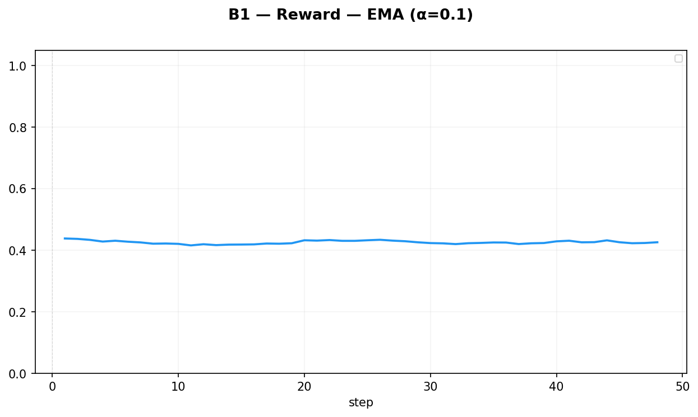
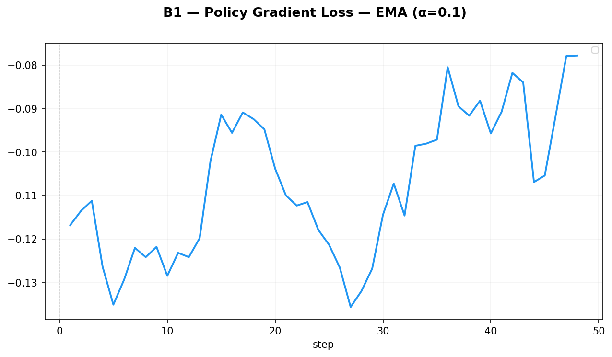
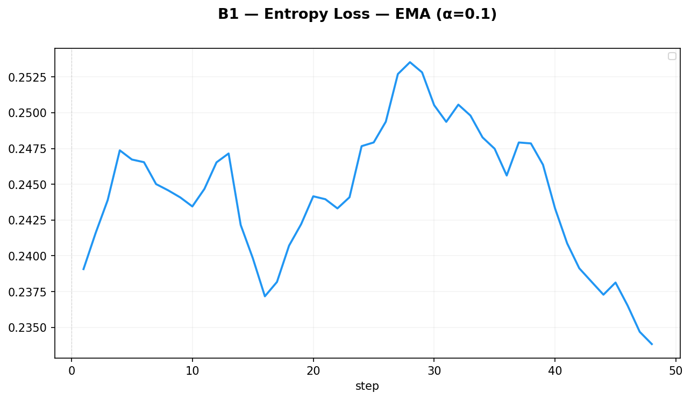
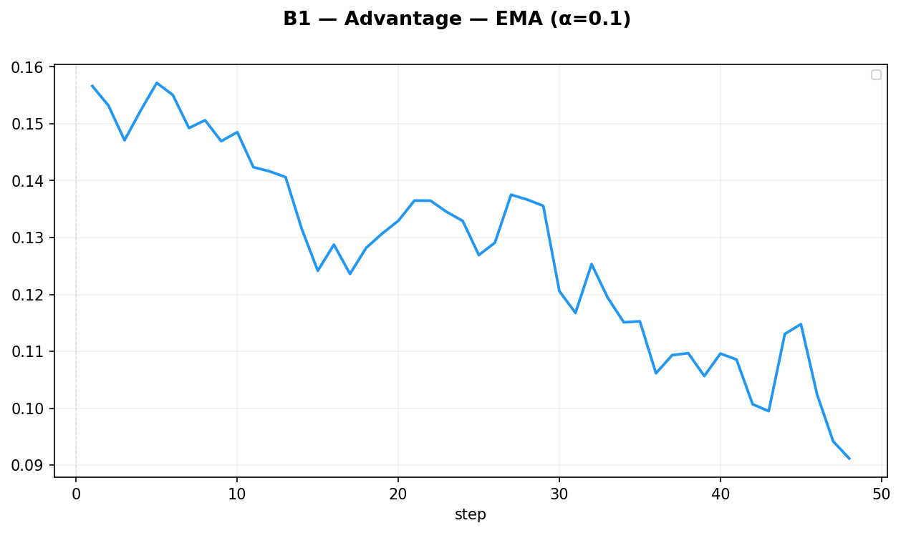

# B1 — 纯 PPO baseline

> 实验日期：2026-08-13 ｜ 数据：`datasets/train.parquet`（中等难度、system-reminder 已剥离，16,000 行 5桶×3,200）

## 参数

| 参数 | 值 |
|---|---|
| 配置 | `configs/run/b1_9b_16gpu.yaml` |
| lr | 1.5e-6（实际运行；yaml 现已统一 2e-6） |
| entropy_coeff | 0.001 |
| rollout_n | 8 |
| train_batch_size | 32 |
| use_kl_loss | false |
| lambda_replay | 0.0（无回放） |
| buffer_enabled | false |

## 图

## 解析

- 训练 48 step，都在 coding 桶内（未跨桶）
- reward 平在 ~0.42–0.45，无上升趋势——frozen judge 打分上限 + 起点已不差
- entropy 从 0.24 缓降到 0.23，无坍缩
- advantage ±2.4 对称，组内 8 条 rollout 区分度充足

## 结论

无跨桶数据（未到 step 100），coding 桶内稳定，无法评估遗忘。
