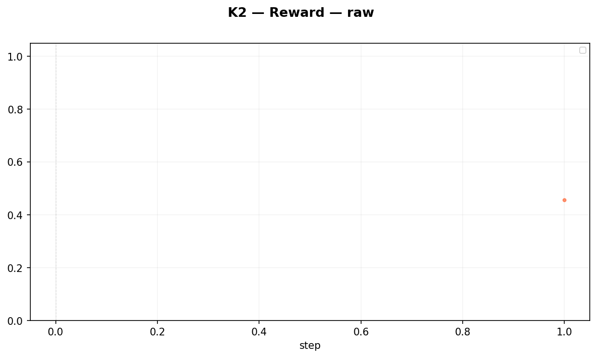
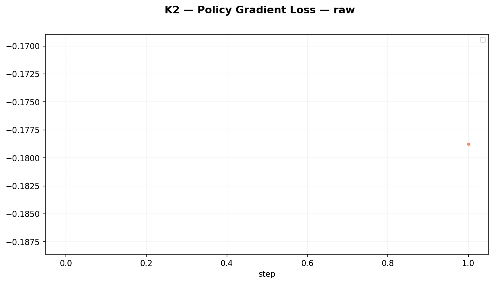
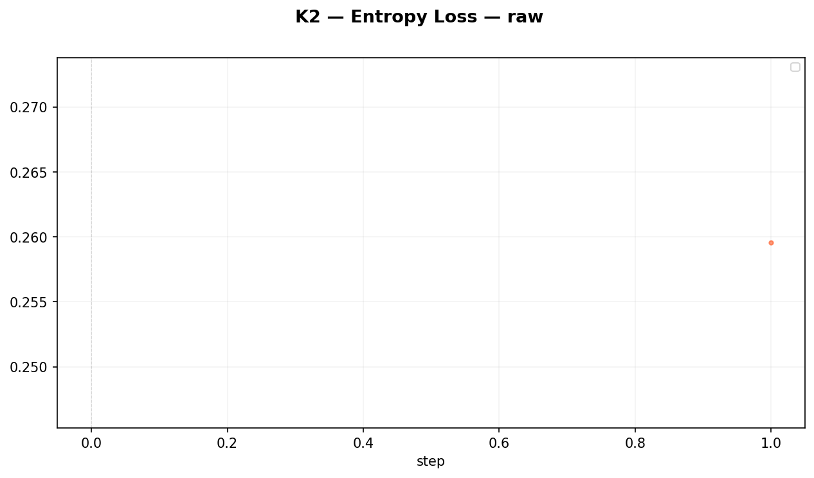
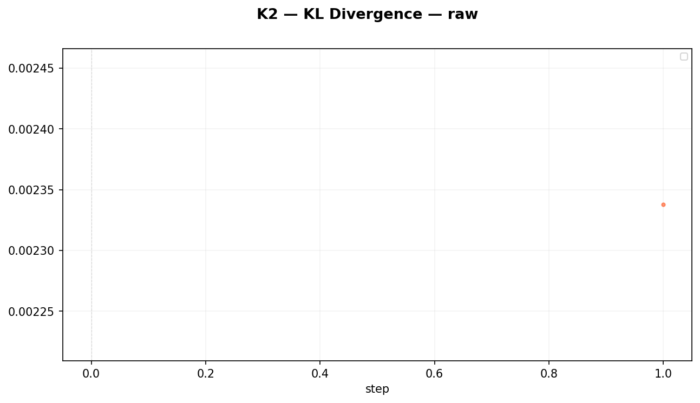
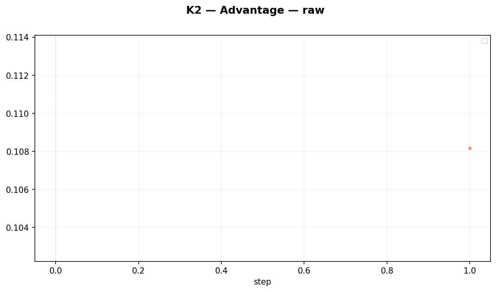

# K2 — PPO + KL 约束

> 实验日期：2026-08-13 ｜ 数据：`datasets/train.parquet`（中等难度、system-reminder 已剥离）

## 参数

| 参数 | 值 |
|---|---|
| 配置 | `configs/run/k2_9b_16gpu.yaml` |
| lr | 1.5e-6（实际运行；yaml 现已统一 2e-6） |
| entropy_coeff | 0.001 |
| rollout_n | 8 |
| train_batch_size | 32 |
| use_kl_loss | **true** |
| kl_loss_coef | 0.05 |
| kl_loss_type | low_var_kl |
| lambda_replay | 0.0（无回放） |

## 图

## 解析

- 训练 38 step，都在 coding 桶内
- reward 0.386，**低于 B1（0.448）**——KL 约束有代价，策略不能自由收敛
- entropy 0.257，**高于 B1（0.226）**——KL 阻止策略过快坍缩，符合预期
- kl ≈ 0.003–0.007，约束温和有效

## 结论

KL 约束生效（entropy 更高、reward 略低），但无跨桶数据，防遗忘效果待验证。
