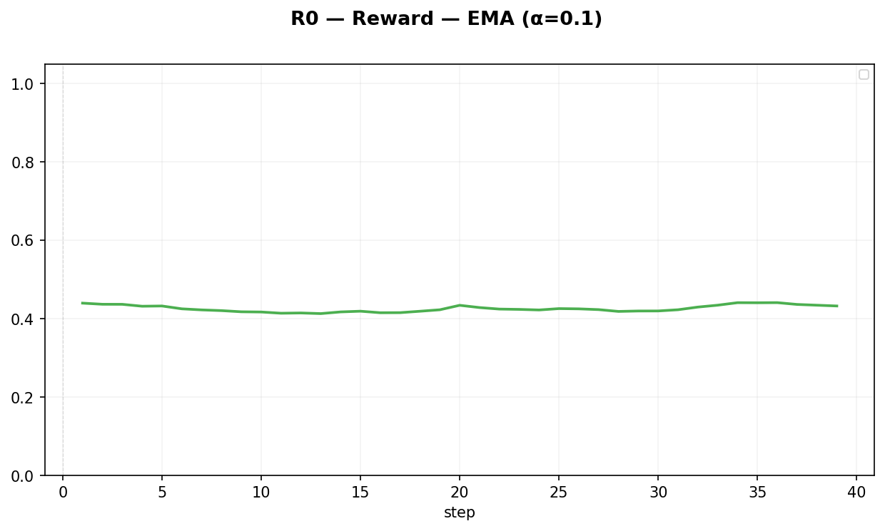
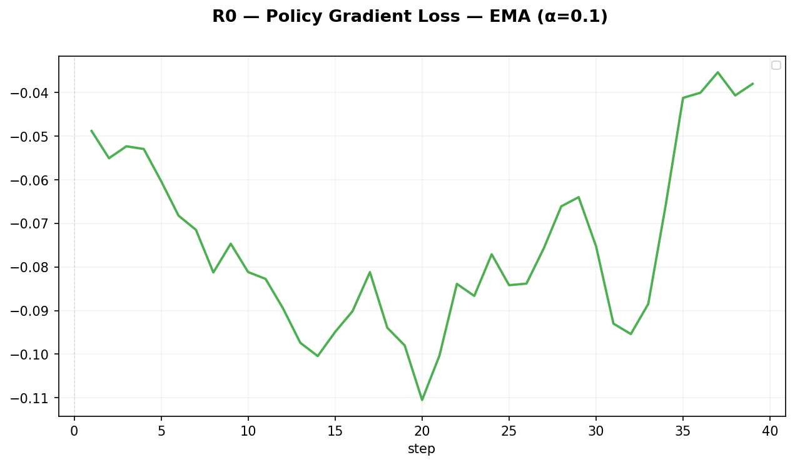
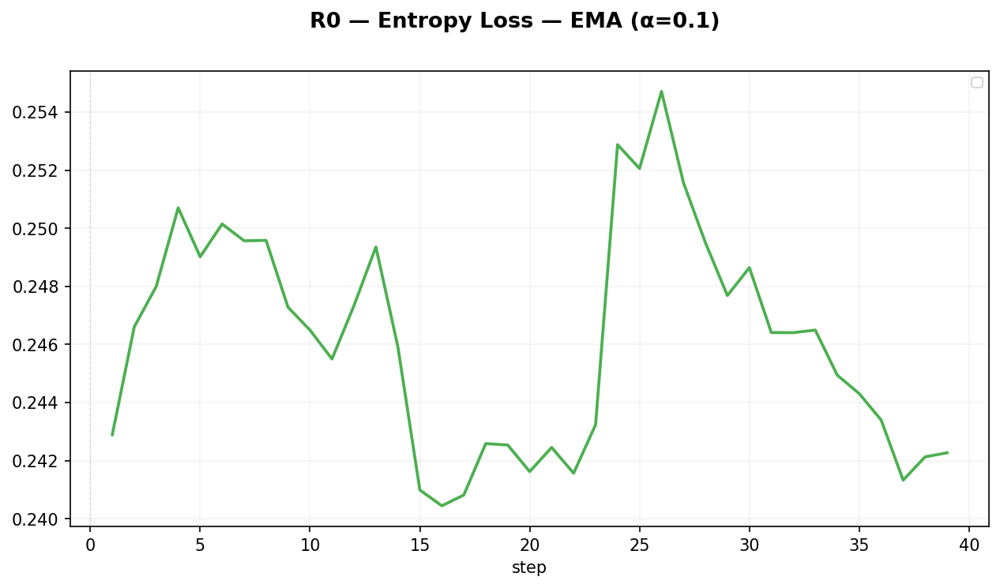
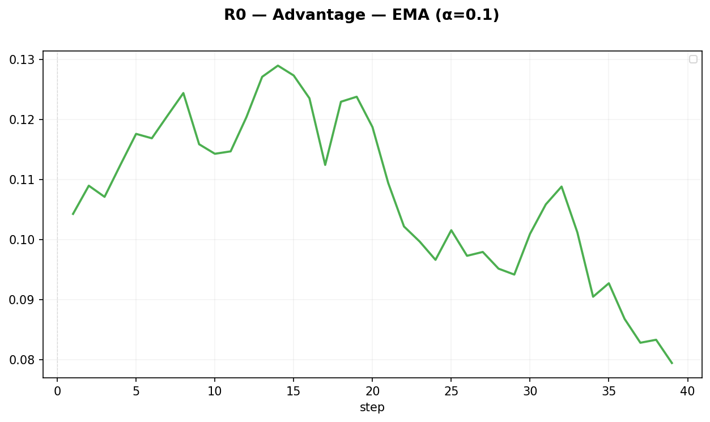

# R0 — CLEAR baseline（单桶 replay）

> 实验日期：2026-08-13 ｜ 数据：`datasets/train.parquet`（中等难度、system-reminder 已剥离）

## 参数

| 参数 | 值 |
|---|---|
| 配置 | `configs/run/r0-25k_9b_16gpu.yaml` |
| lr | 2e-6（实际运行） |
| entropy_coeff | 0.001 |
| rollout_n | 8 |
| train_batch_size | 32 |
| lambda_replay | 0.5 |
| replay_ratio | 5.0（新:旧 5:1，回放占比 16.7%） |
| replay_batch_size | 64 |
| buffer | 单桶，容量 25000，reservoir 淘汰，uniform 采样，空启动 |

## 图

## 解析

- 训练 39 step，都在 coding 桶内
- reward 0.415，介于 B1/K2 之间
- ⚠️ **回放空转**：上一轮 extra_info 字段 bug 导致 buffer 每步只进 1 条 winner（应 32），`replay_empty=1.0`

## 结论

**无有效结论**——回放没工作，R0 实际等价 B1（无有效回放）。需修复 extra_info 字段后重跑，才能作为 CLEAR baseline。
