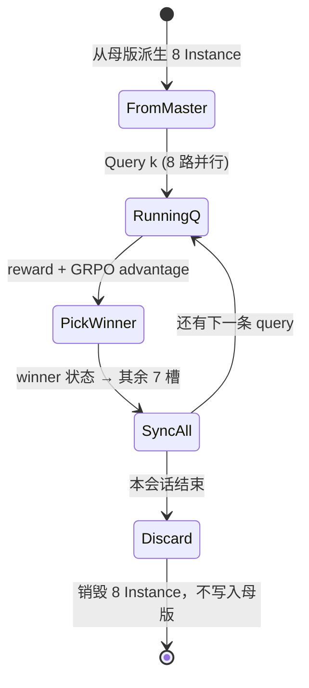

# Sandbox 管理调度指南

> **定位**：训练时 **谁起多少沙箱、何时对齐状态、何时回母版**。  
> 运维/账号见 [`Sandbox_腾讯云操作手册.md`](../../archive/Sandbox_腾讯云操作手册.md)；API 对照见 [`SandboxRollout.md`](../../archive/SandboxRollout.md)。

**最后更新**：2026-06-10（与 @孙豪 确认的目标调度模型）

---

## 1. 术语（先对齐）

| 术语 | 含义 | 规模（本方案） |
|------|------|----------------|
| **母版** | 全局初始环境模板（Tool 或 pause 着的 master Instance） | 1 份，全训练共用 |
| **queries** | 一条会话：内含多个 **query** 顺序执行、共享上下文 | 每 step **16** 条并行 |
| **query** | 会话中的单条用户问题（trajectory 最小单元） | 每条会话内顺序执行 |
| **GRPO 组 / 槽位** | 同一条 query 上并行的 M 个沙箱 | **M = 8**（`rollout.n`） |
| **一步 rollout 总沙箱数** | 并行 sessions × 每会话槽位 | **16 × 8 = 128** |

与数据文件：`datasets/queries.jsonl` 一行 = 一个 **queries**（`queries: [...]` 列表）；调度时 **会话内逐条 query 执行**，不是整行合成一条 trajectory。

---

## 2. 目标行为（三条规则）

### 规则 1：会话内 — 同起点 + 每 query 后同步到 winner

```text
母版
  └─> 派生 8 个沙箱（位级相同起点）
        │
        ├─ Query 1：8 路并行 rollout → reward → GRPO advantage → winner = argmax(A)
        │
        ├─ 【同步】8 个沙箱全部对齐到 winner 的当前状态（磁盘/依赖/文件）
        │
        ├─ Query 2：8 路并行（起点再次相同，且携带 Query1 结束后的会话状态）
        │
        ├─ 【同步】→ winner ...
        │
        └─ Query K …
```

### 规则 2：会话外 — 不保存，始终从母版重新开

一个 **queries** 全部 query 跑完后：

- **不**把本会话最终环境固化为下一批的母版
- 下一条 **queries** 仍从 **最初母版** 派生 8 个沙箱

跨会话的知识累积靠 **Replay Buffer + 模型权重**，不靠沙箱磁盘继承。

### 规则 3：并行度 — 每 step 起 128 个沙箱

```text
一步 rollout
├── queries_1  → 8 沙箱 → q1 → sync → q2 → sync → …
├── queries_2  → 8 沙箱 → …
│   …
└── queries_16 → 8 沙箱 → …

同时进行：16 条会话 × 8 槽 = 128 Instance（需账号并发配额）
```

16 条会话之间 **互不同步**；同步只发生在 **同一会话内的 8 个槽** 之间。

---

## 3. 有没有必要「每 query 后纠正到 winner」？

### 结论：**有必要**（在你这套「每 query 都算组内 GRPO」的前提下）

GRPO 对 **单条 query** 在组内做归一化：

\[
A_i = \frac{r_i - \mathrm{mean}(r)}{\mathrm{std}(r) + \epsilon}
\]

**同一条 query 开始时**，8 个沙箱必须位级一致 —— 这一点与 `SandboxRollout.md` §1 相同。

这个公式成立的隐含前提：**8 条轨迹的 reward 差异只来自策略采样的随机性**。

**会话内下一条 query** 时，若不做同步：

| 不做同步时 | 后果 |
|------------|------|
| Query1 结束后 8 个沙箱状态各不相同 | Query2 的 8 条轨迹从 **不同起点** 出发 |
| 组内比较 mix 了策略差异 + 历史路径差异 | 某槽即使策略好，也可能因「起点更差/更好」被拉高或压低 reward |
| advantage 混入 **环境噪声** | 「执行较好却被抑制优势」会出现 —— 不是模型真差，是组内起点不公平 |

危害比「信号被抑制」更严重，有两层：

1. **方向性错误的梯度（错误归因）**。某槽因为上一条 query 留下的烂摊子（装坏的依赖、污染的文件）导致本条 reward 低，GRPO 会把负 advantage 打到它本条 query 的 token 上——模型这一步可能做得很好，却被教成「这么做是错的」。这不是信号变弱，是 **credit assignment 方向错了**。
2. **σ 被环境噪声污染且随 query 序号累积**。组内 std 混入环境方差，所有 advantage 被整体稀释；环境分歧逐 query 累积，**越靠后的 query 信号越差**。

同步只发生在 **query 之间的边界** 上；单条 query 执行**过程中**不同步——中间发散正是 advantage 的方差来源（与 `SandboxRollout.md` §1 一致）。

**做完 winner 同步后**：

- Query2 的 GRPO 比较的是：**在同一会话状态下**，8 条策略样本的相对好坏
- 会话上下文仍通过 winner 延续（装过的包、生成的文件），符合多轮任务
- 组内起点重新对齐，**per-query advantage 更干净**

### 什么时候可以不同步？

| 策略 | 适用 |
|------|------|
| **每 query 后 sync 到 winner**（本方案） | 会话内多 query + 每 query 都做 GRPO |
| **每 query 前 8 槽全 reset 到母版** | 不要会话内环境演化，只要独立 query（多轮语境只靠 prompt 文本） |
| **只 1 个沙箱跑会话，query 间不 GRPO** | 没有「8 路组内比较」，不适用你的 M=8 设计 |

本方案选 **同步到 winner**，等价于：**会话状态 = 上一轮组内最优轨迹落地后的环境**。

### 与「优势是对每一个 query 计算」的关系

- **对**：每条 query 各自一组 reward → 各自组内 advantage（8 条一组）
- **同步解决的是**：下一条 query 的 **8 条组内比较** 起点一致，避免被 **上一条 query 留下的不对称状态** 污染
- **不解决**：不同 queries 之间的绝对 reward 尺度 —— 那是数据/打分器问题，靠 GRPO 组内归一化已局部处理

### 三个实施要点（易漏）

**① 同步的不只是磁盘，还有对话上下文。**

同步到 winner 后，下一条 query 喂给模型的 prompt 中的「前文历史」必须是 **winner 那条轨迹**，而不是各槽自己的上一条轨迹——否则出现 prompt 说「我刚才做了 A」、环境里却是 winner 做的 B 的错位。

等价表述：**会话的正史 = 每步 winner 轨迹的拼接**；输家的 7 条轨迹只用于该条 query 的 GRPO 更新（仍进 Replay Buffer），之后从会话谱系中丢弃。

> 已接通代码：`run_query` 把 `session_history`（历代 winner 消息）作为 `history` 传给 `agent_fn`，`make_react_agent_fn` 用它作生成前缀；`sync_to_winner` 只把 **winner 的本轮消息**追加进 `session_history`（不双计前缀）。见 `tests/test_session_pool.py::test_winner_history_propagates_to_next_query`。

```text
会话正史:  winner(q1) ─→ winner(q2) ─→ winner(q3) ─→ …
              │              │              │
           7 条输家       7 条输家       7 条输家     ← 只供该 query 的组内 GRPO，
          （q1 组内）    （q2 组内）    （q3 组内）      不进入后续 prompt/环境
```

**② winner 同步的已知偏置（可接受，但要知道）。**

每步都选最优路径继续，意味着越靠后的 query 总是在「最好情况」的环境下训练——模型学不到「从自己前面的烂摊子里恢复」。这类似 expert iteration，对「干净的 per-query 信号」是合理取舍，**当前不改**；若后续发现模型多轮容错差，可改为按 `softmax(reward)` 抽样 sync 目标而非 `argmax`。

**③ winner 兜底规则（全失败/同分时）。**

| 情形 | 兜底 |
|------|------|
| 8 条同分（含全 0） | 随机选一槽作 sync 目标（或保持上一步状态不 sync） |
| 打分器异常 | 该 query 不计入训练，槽位保持上一边界状态重跑 / 跳过 |

具体取哪种待 PoC 时定，但必须显式定义，避免调度器在边界 case 卡死。

---

## 4. 调度状态机（单条 queries）



| 阶段 | 动作 | 腾讯云侧（概念） |
|------|------|------------------|
| 派生 | 8 槽从 **同一母版** 起跑 | 同一 Tool 起 8 Instance，或 resume 同一 paused 母版 ×8（API 待确认） |
| 执行 | `run_code` / agent loop | 与现 `E2BSandbox` 相同 |
| 选 winner | `argmax(advantage)` | `rollout/sandbox_client.select_winner` |
| 同步 | 7 槽 ← winner 状态 | **PoC**：pause/resume、Instance→Tool、或平台克隆 API（见 §6） |
| 会话结束 | kill 8 槽，母版不变 | 不 `freeze` 到全局母版 |

---

## 5. 一步 rollout 的并行拓扑

```text
                    ┌─ 母版（全局唯一，跨 step 不变）
                    │
    ┌───────────────┼───────────────┐
    │               │               │
 queries_1      queries_2 …   queries_16
 [8 slots]       [8 slots]      [8 slots]
    │               │               │
 q1→sync→q2…    独立流水线      独立流水线
    │               │               │
  结束销毁        结束销毁         结束销毁
（不回写母版）  （不回写母版）   （不回写母版）
```

| 维度 | 数量 |
|------|------|
| 并行 queries（会话） | 16 |
| 每会话槽位 M | 8 |
| **总 Instance** | **128** |
| 会话内 query | 顺序 + 每步后 sync |
| 会话间 | 独立，不同步 |

与 `configs/base.yaml`：`rollout.n = 8`；若一步 16 会话，需在 rollout 调度层设 `sessions_per_step = 16`（或 `gen_batch_size` 按会话条数解释），与 `train_batch_size: 1024` 的「每 step 多少会话」需后续在 runner 里对齐。

---

## 6. 「同步到 winner」在平台上怎么做（实现待 PoC）

设计意图是 **D：把 winner 状态扩散到其余 7 槽**。

> ⚠️ **关键约束（别踩坑）：会话内绝不能 kill winner。** winner 实例是本会话**累积状态的唯一活载体**——后续 query 依赖它，且依赖的不只是磁盘文件，还有**进程/内存态**（agent 装好并跑着的服务、加载进内存的数据、shell 环境）。磁盘快照未必抓得到这些。所以「kill 全部 8 个 → 从 winner 快照 fork 8 个」**不等价**：一旦快照不完整 / 异步 / 平台不支持，整条会话依赖链就断了。**会话内只 kill 输家的 7 个，winner 必须存活到会话结束。**

腾讯云没有标准 `docker commit`，会话内 sync 的可选实现：

| 路径 | 做法 | 会话内 sync | 会话结束 |
|------|------|------------|----------|
| **D1 复制/fork（推荐）** | **winner 保活**；kill 输家 7 个 → 从**存活的 winner** fork/克隆出 7 个替补 | ✓ winner 全程不死 | 此时才 kill 全部 8 个，母版 Tool 不动 |
| **D1' 原地覆盖** | winner 保活；把 winner 磁盘覆盖到其余 7 个存活实例 | ✓ | 同上 |
| ~~D2 杀重建~~ ❌ | ~~kill 全部 8 个 → 从快照重建~~ | **不可用**：kill 了状态载体，丢进程/内存态、断依赖链 | — |
| **A freeze Tool** | winner → 会话级临时 Tool（若 API 支持 Instance→Tool） | 下轮从该 Tool 起替补 | **不符合**「不保存到全局母版」——仅当 Tool 是会话级临时、会话结束即删时可考虑 |

> **一个待 PoC 的张力**：query_{k+1} 要求 8 槽**位级一致**，但 winner 保活意味着 winner 有活进程、7 个替补可能只继承磁盘 → 进程态不一致。能否让 7 个替补连进程态都等于 winner，取决于平台 fork 的保真度（仅磁盘 vs 全活态 CRIU 级）。**若平台只能磁盘快照**：要么任务设计避免依赖未被快照的进程态，要么接受「winner 有进程态、替补只有磁盘态」这一已知不对称（多数任务的依赖在磁盘/文件，影响有限）。此为 §6 头号 PoC 项。

**推荐工程顺序**：

1. PoC：单会话 8 槽、2 个 query，验证「sync 后 7 个替补与**存活 winner** 文件一致」（如 winner `touch /tmp/step`，替补可见）；确认 **winner 全程未被 kill**
2. PoC：进程态保真度——winner 在 query1 起一个后台服务，query2 检查替补能否复用（决定上面那条「张力」走哪条路）
3. PoC：16 会话 × 8 槽并发上限与耗时
4. 实现 `SessionSandboxPool`（见 §7），再接入 verl rollout

---

## 7. 与仓库代码的映射（待实现）

| 能力 | 现状 | 目标 |
|------|------|------|
| 起 Instance + `run_code` | `rollout/sandbox_client.E2BSandbox` | 保留 |
| GRPO advantage / winner | `grpo_advantages`, `select_winner` | 保留 |
| 会话内 winner 同步 | **未实现** | `SessionSandboxPool.sync_to_winner(winner_idx)` |
| 16 会话并行调度 | **未实现** | `RolloutScheduler(sessions=16, slots=8)` |
| 会话结束回母版 | **未实现** | `pool.close()` 不更新 global master |
| 查询状态 | `docker/sandbox/ops/query.sh` | 运维用 |

伪代码（调度层，非最终实现）：

```python
master = MasterTemplate(tool="agentic-cl-code-interpreter")  # 全局母版，跨 step 不变

for step in training:
    for session in parallel_sessions(16):  # 16 路并行
        slots = master.spawn(8)           # 同起点
        for query in session.queries:     # 会话内顺序
            trajs = parallel_run(slots, query)
            rewards = score(trajs)
            adv = grpo_advantages(rewards)
            w = select_winner(rewards, trajectory_ids)  # 含同分/全失败兜底（§3 ③）
            slots.sync_to(w)              # 8 槽磁盘对齐 winner
            session.history += trajs[w]   # 对话上下文同样取 winner（§3 ①）
        slots.destroy_all()               # 不写入 master
```

---

## 8. 与旧版 `SandboxRollout.md` 的差异

| 项 | 旧设计（训练轮次 × 单 query） | **本指南（会话 × 多 query）** |
|----|------------------------------|------------------------------|
| 环境演化 | 每个 **query_id** 一条环境链，跨 training step 累积 | 仅在 **单个 queries 会话内** 累积 |
| winner 之后 | 固化为新母版，下轮同 query 再用 | 会话内 **sync 到 8 槽**；会话外 **丢弃** |
| 全局母版 | 每 query 可演化 | **固定**，每批 queries 从同一母版起跑 |
| 并行 | B query × M traj | **16 会话 × 8 槽**，会话内 query 顺序 |

旧文档中「同 query 跨轮次知识演化」针对 **同一 query_id 在多个 training step 出现**；本方案把「多轮」放在 **同一会话的多个 query** 里，且 **不在会话之间** 保留沙箱状态。

---

## 9. 运维与配额

```bash
# 128 Instance 跑起来前建议先看配额与当前占用
bash docker/sandbox/ops/ops.sh query
```

| 风险 | 缓解 |
|------|------|
| 128 并发超配额 | 与平台确认上限；或降 `sessions_per_step` |
| sync 延迟大 | 计入 rollout 尾延迟；监控 P95 |
| Instance 泄漏 | 每会话 `destroy_all`；周期 `ops query` |

---

## 10. 文档索引

| 文档 | 内容 |
|------|------|
| 本文 | **调度、同步、128 并发、母版策略** |
| `Sandbox_Agent架构.md` | 动作在沙箱内/推理在外、OpenClaw、随机用户文件系统、镜像依赖 |
| `SandboxRollout.md` | 平台 API、Tool/Instance、PoC 清单 |
| `Sandbox_冒烟指南.md` | 账号、ops、冒烟 |
| `Sandbox_腾讯云操作手册.md` | 控制台与 build 镜像 |
