# Continual Learning 系统设计

---

## 目录

- [调研思路与 CL Loss 设计](#调研思路与-cl-loss-设计)
- [Replay Buffer 设计](#replay-buffer-设计)
- [$L_{replay}$ 权重 $w$ 计算规则](#l_replay-权重-w-计算规则)
- [实验参数组合设计](#实验参数组合设计)
- [评测指标体系](#评测指标体系)
- [GPU 资源分配与训练流水线](#gpu-资源分配与训练流水线)
- [训练精度方案](#训练精度方案)
- [待解决问题](#待解决问题)
- [参考文献](#参考文献)

---

## 调研思路与 CL Loss 设计

### 调研思路概要

```text
新任务 rollout → compute reward / advantage → 计算 L_rl
replay buffer 采样旧数据 → 计算 L_replay
当前策略与参考策略对齐 → 计算 L_kl
最后按权重汇总 loss → update
```

### 核心想法

在现有 RL 更新流程上加入 replay 和策略约束，使模型在学习新任务时尽量减小对旧任务能力的遗忘。

### CL Loss 公式

---
$$ L_{cl} = \lambda_1 L_{rl} + \lambda_2 L_{kl} + \lambda_3 L_{replay} + \lambda_4 L_{ent} $$
---

### 各 Loss 项定义

其中各项含义如下：

- $L_{rl}$：新任务上的原始 RL 损失，是主要优化目标。
- $L_{kl}$：策略约束项，用于限制当前策略相对参考策略的漂移，缓解灾难性遗忘。
- $L_{replay}$：在 replay buffer 上进行监督回放，巩固旧任务行为能力。
- $L_{ent}$：**Entropy 正则项，最大化当前策略的输出分布展开度，防止策略坍缩（Echo Trap）。所有 Phase 默认开启，$\lambda_4 = 0.001 \sim 0.005$**。

> **不使用 $L_{reg}$（参数 L2 正则）**：$L_{reg}$ 在函数空间约束策略行为，而 $L_{kl}$ 直接在输出分布空间约束策略行为，两者目标重叠但 $L_{kl}$ 更精确（参数距离 ≠ 功能距离），因此该项权重为 0，原 $\lambda_4$ 槽位让给 $L_{ent}$ 使用。

$$ L_{kl} = D_{KL}(\pi_{new} || \pi_{ref}) = \sum_{a}\pi_{new}(a|s) \cdot \log\left(\frac{\pi_{new}(a|s)}{\pi_{ref}(a|s)}\right) $$

$$ L_{replay} = \mathbb{E}_{(s,a) \sim Buffer}[-\log \pi_{new}(a|s) \cdot w] $$

$$ L_{ent} = -\mathbb{E}_{s \sim \text{online rollout}}[H(\pi_{new}(\cdot|s))] = \mathbb{E}_{s}\left[\sum_a \pi_{new}(a|s) \log \pi_{new}(a|s)\right] $$

$$ L_{reg} = ||\theta - \theta_{prev}||^2 \quad \text{（弃用，权重 0）} $$

其中，$w$ 表示 replay 样本的权重，详见下方"$L_{replay}$ 权重 $w$ 计算规则"。

### Entropy 项必加的理由

> **为什么 $L_{ent}$ 默认开启（直接进 B1 配置，不放 Phase 6 探索）：**
>
> - **traj/query=8（GRPO 组大小）**：rollout 规模为 1024×8 / 4096×8（query 数 × 每 query 轨迹数）。组内 8 条轨迹提供 GRPO advantage 方差；若 $\pi_{new}$ entropy 仍塌，组内轨迹仍可能趋同 → $A \approx 0$。$L_{ent}$ 仍是防 Echo Trap、维持组内多样性的关键力量。
> - **$L_{rl}$/$L_{replay}$/$L_{kl}$ 都不能替代**：前两者 mode-seeking，加速 entropy 下降；KL 只保形状接近 $\pi_{ref}$，不保 entropy 不塌。详见 B4（Echo Trap）。
> - **成本 0**：verl/GRPO 标配 entropy bonus，无额外工程。
>
> **默认 $\lambda_4 = 0.001$**；若 output entropy 在前 100 step 下降 > 50%，调大到 0.005 ~ 0.01。

## Replay Buffer 设计

> 目标：纯文本 continual learning，学新任务时不遗忘旧能力。不纳入 multimodal（仅 4 任务，能力结构不同）。

### 9 桶结构

> **完整算法规范见 [`doc/source/BucketAlgorithm.md`](BucketAlgorithm.md)**——本节仅列与实验设计直接相关的部分（桶名/任务数/quota 逻辑/回放比例），配额公式、优先级、采样、淘汰、权重持久化等完整细节以 BucketAlgorithm.md 为准。

桶体系（2026-07-04）= ClawEval 官方 category 合并（去多模态），**单层、无子桶**。定义与官方 category 映射见 `runs/_analysis/capability_buckets/buckets.json`。

```text
ReplayBuffer 9 桶 (详见 BucketAlgorithm.md §1)
├── workflow      [56]
├── ops           [44]
├── qa            [36]
├── finance       [20]
├── office        [11]
├── communication [11]
├── safety        [ 9]
├── coding        [ 2]
└── research      [ 6]
```

纯文本 buffer 总任务数 = 195。

| 桶 | 任务数 | 核心能力 |
|---|---:|---|
| **workflow** | 56 | 多步骤任务组织、流程推进、子任务拆解与执行顺序控制 |
| **ops** | 44 | 工具使用、命令与系统操作、文件读写、约束遵守、程序性执行 |
| **qa** | 36 | 检索、阅读理解、事实问答、记忆检索（即查即答，不产长报告） |
| **finance** | 20 | 结构化业务规则、数值意识、采购与合规约束、按金融规则算账 |
| **office** | 11 | 办公文档与表格处理、办公语境问答、数据分析类办公任务 |
| **communication** | 11 | 表达、改写、润色、翻译、面向受众的沟通与内容创作 |
| **safety** | 9 | 安全合规与风险判断、拒绝不安全请求、漏洞/威胁评估、审慎裁定 |
| **coding** | 2 | 代码编写、审查、调试、修复与正确性推理 |
| **research** | 6 | 多来源检索并综合成报告/简报/摘要（区别于 qa 的即查即答） |

### Quota 分配

> 完整公式与 α 取值论证见 [`BucketAlgorithm.md` §2](BucketAlgorithm.md#2-配额分配allocate_quota)。

$$q_i = C \cdot \frac{n_i^{\alpha}}{\sum_j n_j^{\alpha}}, \qquad \alpha=0.5$$

- $C$：总 buffer 容量（25,000 条轨迹）；$n_i$：第 $i$ 桶任务数
- soft_target（超则加速淘汰）+ bucket_floors（= cap/30，不可跌破）双层控制

回放比例：`replay_batch_size=512` 叠加在 `train_batch_size=1024` 上，每步 1536 样本中 512 是回放（**33%**）。

### Priority（抗遗忘）

> 完整 4 信号公式与权重见 [`BucketAlgorithm.md` §5](BucketAlgorithm.md#5-priority4-信号融合)。

训练推进时 reward 整体上升，按 reward 绝对值排序会使新轨迹系统性压制旧轨迹。Priority 反映的是**轨迹对防止遗忘的重要性**，而非**当时取得多高 reward**。

| 信号 | 权重 | 定义 |
|---|---:|---|
| **Forgetting Risk** | 0.5 | 当前模型在该轨迹上是否出现性能回退 |
| **Rarity** | 0.25 | 桶内低频模式/模板，防热门模板占满 |
| **Difficulty** | 0.25 | 桶内相对难度，覆盖边界/复杂场景 |
| ~~Diversity~~ | v1 禁用 | 无 trajectory embedding 管线 |

### 淘汰与采样

> 完整规则见 [`BucketAlgorithm.md` §4, §6](BucketAlgorithm.md)。

- **淘汰**：桶内竞争，禁止跨桶挤出；bucket_floors（cap/30）以下永不淘汰
- **采样**：两级——桶级 70% 按 soft_target 比例 + 30% 均匀 + 饥饿惩罚；桶内 priority 加权随机（非 top-k）

**主存储 + 轻量索引**，支持：按 ID / 按 bucket / 按 priority 排序 / 按 pattern 访问。精确查询（调试/诊断）与训练采样（概率抽样）分开。

### 冷启动数据需求

> RL 训练开始前向 buffer 预灌冷数据，避免 `L_replay = 0`、空桶 starvation。

**数量**：硬下限每桶 `q_min = 2000`，9 桶合计 **18,000 轨迹**；推荐 **20,000**。每 query 8 轨迹（标准）或 1（经济版，仅救火）。约需会话：下限 ~281、推荐 ~312（假设平均每会话 8 query）。

**交付格式**：会话清单 JSON（`record_id` / `bucket` / `queries` / `meta.cold_seed` / `meta.policy`）+ 轨迹记录（`trajectory_id` / `messages` / `response_token_ids` / `original_logprobs` / `reward` / `bucket` 等必填字段）。

**单/多 query 占比**：多 query ≥ 60%。多轮会话任务不得交付单 query 会话。各桶建议见 `bucket_buffer.md`（archive）§7.6。

**失败处理**：A（打分器异常）不进 buffer 不 sync 但继续；B（软失败）进 buffer + 随机 winner sync + 继续；C（硬失败）终止 session。

**验收清单**：轨迹总数 ≥ 18k；每桶 ≥ 2k；多轮会话无单 query；每条含 messages+token+logprob+bucket；`reward=null` 不计入配额；硬失败 session 无脏数据。

**冷启动数据来源**：只用 GPT-5（off-policy 强模型）采集轨迹填 buffer。Replay Buffer 冷启动不要求使用后续训练的 Actor——只需覆盖初始能力分布即可；之后由在线 Actor 持续更新 Buffer。**红线**：gpt-5 数据只进 buffer 做 replay，绝不 SFT 蒸馏 27B。

---

### $L_{replay}$ 权重 $w$ 计算规则

#### 最终公式

$$w_t^{(i)} = \text{normalize}\Big(\text{clip}\big(\text{priority}_i \cdot \frac{\gamma^{\text{block}(t)} + \delta^{K_i - 1 - \text{block}(t)}}{2},\; q_5,\; q_{95}\big)\Big)$$

> **块索引约定（与代码一致）**：$\text{block}(t) \in \{0, 1, \dots, K_i - 1\}$（0 起始）。末端项用 $\delta^{K_i - 1 - \text{block}(t)}$ 而非 $\delta^{K_i - \text{block}(t)}$，这样末块（$\text{block}=K_i-1$）得 $\delta^0 = 1$、首块得 $\gamma^0 = 1$，U 形严格对称。代码实现见 `replay_buffer/weighting.py::_u_shaped_block_weights`。

**作用域：仅 response tokens（模型生成部分）**。用户请求（prompt）不参与 loss 计算，也不参与块切分与权重分配——$t$ 从 response 首 token 开始计数，block(t) 的定义域 = response 内的动作块序列。与 verl 的 `response_mask` 作用域一致。

两个独立维度合成：

| 维度 | 作用对象 | 公式 | 起步超参 |
|---|---|---|---|
| **A. Priority（trajectory 级）** | 每条轨迹一个值 | 4 信号融合（forgetting_risk / rarity / diversity / difficulty） | $\alpha_1$=0.4, $\alpha_2$=$\alpha_3$=$\alpha_4$=0.2 |
| **B. U 形块位置权重（token 级，粗粒度）** | 轨迹按**动作块**划分为 $K_i$ 块（每条轨迹的 $K_i$ 不同，$\text{block}(t)$ 0 起始），块内等权；首尾两端高、中间低 | $\frac{\gamma^{\text{block}(t)} + \delta^{K_i - 1 - \text{block}(t)}}{2}$ | $\gamma = \delta$ = 0.88；$K_i$ 由数据决定（详见下方"块的定义"） |

最后做 **clip 到 [5%, 95%] 分位数 → normalize**（保证 batch 内 $\sum w$ 归一）。

##### 块的定义：按动作块（action block）切分，退化时回退等长切分

**优先使用动作块切分**，按 trajectory 内的**结构标签**自然划分：

- `思索...完结` — 思考块
- `<toolcall>...</toolcall>` — 工具调用块
- `<observation>...</observation>` — 工具返回观测块
- `<final_answer>...</final_answer>` — 最终回答块
- 其他可能的结构（待数据观察后补充，通过 `configs/base.yaml` 的 `block_types` 配置）

**退化规则**：当轨迹无法解析动作块（无结构标签 / 标签不合法），或解析后仅得到 $K_i = 1$（整条轨迹只有一块 = 无 U 形可做），自动退化为**等长 token 切分**（fallback_K=20）。退化不报错，不丢弃样本——保证任何格式的轨迹都能拿到权重。

**长块二次切分**：单个动作块超过阈值（默认 100 tokens）时，在块内做等长二次切分，子块继承父块的 U 形权重（块内不再做微 U）。避免一个 500-token 的长思考块和 30-token 的 toolcall 块获得相同分辨率。

**理由**：
1. **等长切分的中间点没有语义意义**——一个 50-token 的思索块和一个 200-token 的 `<toolcall>` 在等长切分下被混在同一块里，权重曲线对模型实际学到的"早期决策 vs 末端总结"区分度弱；
2. **动作块与 agent loop 的语义对齐**——首块通常是首次思考（早期分支决策），末块通常是 final_answer + 邻近思考（结论生成），U 形的"首端重 + 末端重"能直接落到正确的语义段；
3. **$K_i$ 因 trajectory 而异**——不同任务的动作步数差距很大（简单 QA 可能只有 1 思考 + 1 final_answer = 2 块；复杂 workflow 可能 10+ 块），用每条轨迹自己的 $K_i$ 而非全局 $K$；
4. **跨样本可比性**：U 形曲线本质用相对位置 $\text{block}(t) / K_i$，$K_i$ 不同时端点都是 1.0、中点都是最低，clip + normalize 后仍可比；
5. **退化兜底**：纯文本轨迹 / 标签解析失败 / $K_i=1$ 时自动退化为等长切分，不丢样本、不崩训练。

**实现先延后**：具体的标签集合、嵌套规则（如 `<toolcall>` 嵌套思索块怎么算）、退化判定的精确条件等——**等拿到真实 rollout 数据后再定**。在拿到数据前，代码以"等长 K 块"作为可工作的 fallback 实现。

> **U 形动机（2026-06-08 反转）**：原方案是单调衰减 $\gamma^{\text{block}(t)}$ + final_answer boost $\beta_{\text{final}}$。反转原因：**末端的重要性不止 final_answer 一个 token 段，靠近末端的几个块（结论前的总结、决策前的关键判断）也很重要**——单点 boost 抓不住整段，应改为对末端整体抬升的连续曲线。$\gamma^{\text{block}(t)} + \delta^{K_i - \text{block}(t)}$ 让首块（早期决策分支）与末块（最终输出 + 邻近段）同时受重视，中间块（执行细节）相对降权。原否决论证见下方"备选方案"表，已变更为采纳。

#### 三种实验方案（Phase 3 对照）

| 编号 | 方案 | 公式 | 角色 |
|---|---|---|---|
| **W0** | 均权（$\gamma=\delta=1$） | $w_t^{(i)} = \text{normalize}(\text{clip}(\text{priority}_i \cdot 1,\; q_5,\; q_{95}))$ — 同公式，$\gamma=\delta=1$ | 等权对照，与 W2 同公式仅超参不同 |
| **W2** | Priority × U 形块权重 + clip | 上面最终公式 | 主方案，**替换原 R4-w 实验** |

> 中间版本 W1（不带 clip）已合并入 W2，实验阶段直接对比 W0 vs W2。如 W2 表现差，再 ablation 去掉某个组件定位原因。

#### 关键超参起步值

| 超参 | 起步值 | 说明 |
|---|---|---|
| $\gamma$（首端衰减底数） | **0.88** | 首块 $\gamma^0 = 1.0$；以 $K_i=20$ 估算，中间块 $\gamma^{10} \approx 0.279$，末块 $\gamma^{20} \approx 0.078$ |
| $\delta$（末端衰减底数） | **0.88** | 与 $\gamma$ 对称；末块 $\delta^0 = 1.0$；以 $K_i=20$ 估算，中间 $\delta^{10} \approx 0.279$，首块 $\delta^{20} \approx 0.078$ |
| 合成端点权重 | $\gamma^0 + \delta^{K_i-1} \approx 1.0 + \text{small}$ | 首尾对称；中间最低点 $\approx 2 \cdot \gamma^{(K_i-1) / 2}$；$K_i=20$ 下端点/中点比 ≈ 1.93× |
| $K_i$（每条轨迹的块数） | **由动作块切分决定** | 不固定，详见上方"块的定义"。代码 fallback 用等长 $K=20$ |
| Priority 4 信号融合权重 $\alpha$ | (0.4, 0.2, 0.2, 0.2) | forgetting_risk 占主导 |
| 除数 2 | **固定** | 使 $\gamma=\delta=1$ 时 $w=1$（均权），见下方等价关系 |
| Clip 分位数 | (5%, 95%) | 防极端值，对 outlier 鲁棒 |

##### $\gamma=\delta=1$ 的等价关系

当 $\gamma = \delta = 1$ 时，对任意 block 位置 $b$：

$$\frac{1^b + 1^{K_i - 1 - b}}{2} = \frac{1 + 1}{2} = 1 \quad \forall\, b$$

即**所有块权重恒等于 1**，U 形退化为水平线 = 等权（与 W0 等价）。这使得 $\gamma=\delta=1$ 成为 W2 方案的**内置均权基线**——无需切换 scheme，只需将两个参数设为 1 即可回到 W0。因此：

- **W0 不再需要单独的 scheme**——设 `gamma: 1, delta: 1` 即可（代码已删除独立的 `_w0` 分支，`scheme: W0` 内部即 `gamma=delta=1`；真正"无 priority"的均权用 buffer 的 `priority_type: uniform` 表达，见 R3）
- **实验对照更干净**：W0 vs W2 的唯一变量是 $\gamma, \delta$ 的值（1 vs 0.88），不涉及公式形式差异
- **超参连续可调**：$\gamma=\delta$ 从 1.0 逐渐降低到 0.88 → 0.80 → ...，U 形从"无"到"温和"到"激进"连续变化，方便 ablation 扫描

> **超参选取注记**：$\gamma=\delta=0.97$（原单调衰减起步值）下端点/中点比仅 1.06×，U 形效果近乎无；调到 0.88 后端点/中点比 ~1.93×（按 $K_i=20$ 估），与原"首块/末块比 1.78×"在量级上对齐。**$K_i$ 越小（短轨迹），同 $\gamma$ 下端点/中点比越小**——例如 $K_i=4$ 时 $\gamma^2=0.774$，端点/中点 = $(1+0.774^2) / (2 \cdot 0.774) \approx 1.04$，U 形几乎消失。短轨迹场景需用更小的 $\gamma$（如 0.7）才能保留 U 形语义；这一点等数据到位后在 R4-w 中扫描验证。如 Phase 3 R4-w 表现弱，可在 ablation 中扫描 0.85 / 0.92 / 0.97 三档以分离"U 形是否有效"与"超参是否合适"。

#### 设计动机

- **Priority 加权**：让"防遗忘价值高"的轨迹对 loss 贡献更大（文献 A9）；
- **U 形块权重**：早期 token 决定整条轨迹的"分支"（选哪个工具、走哪条路径），加权使模型对早期高方差决策点学习更准；末端连续多块（最终输出与邻近的结论生成段）同样重要，单 token 段 boost 不足以覆盖，端点指数项 $\delta^{K_i - \text{block}(t)}$ 实现连续抬升；中间执行细节相对降权；
- **按动作块切分**：让权重曲线的"首端/末端"对齐到语义边界（首次思考 / final_answer），而非任意 token 位置；
- **Clip**：防止单条样本因 priority + 块位置组合产生极端权重，放大噪声；
- **整体剪枝（剪 $w_t^{(i)}$ 整体而非仅 priority）**：极端值由 priority、块权重组合放大，必须对最终乘积剪枝才能控制。

#### 暂未采用的备选方案（备查）

以下方案在设计阶段评估过但未采用，记录原因便于后续如需扩展：

| 备选方案 | 原理 | 暂不采用的原因 |
|---|---|---|
| **Token 级衰减**（$\gamma^t$，而非块衰减） | 每个 token 单独衰减 | 在 1000 token 长度下，$\gamma^t$ 衰减过急（$\gamma$=0.999 末段仍有 0.37），需块级粗粒度替代 |
| ~~**U 形权重**（$\gamma^t + \delta^{T-t}$）~~ ✅ **2026-06-08 已采纳为主方案** | 首尾都重，中间轻 | ~~原否决论证：两个指数项相加被相互稀释，量化效果弱（首尾差异 < 5%）；语义不如"final_answer boost"清晰~~ — **反转原因**：末端的重要性不止 final_answer 一个 token 段，靠近末端的其他块也很重要，单点 boost 抓不住整段，需要对末端整体抬升的连续曲线。原否决论证中"首尾差异 < 5%"是基于 $\gamma=\delta=0.97$ 推算，调到 0.88 后端点/中点比可达 ~1.93×，量化效果足够。 |
| **单调块衰减 + final_answer boost**（前主方案） | $\gamma^{\text{block}(t)} \cdot \beta_{\text{type}(t)}$，仅末段 token 加权 | 末端"靠近答案的多个块都重要"无法用单点 boost 表达；改为 U 形后此方案降级为备选。如 W2 表现差且定位到"首端权重过高"，可回退到此方案。 |
| **Token 类型加权**（thinking/tool_call/observation 各自 $\beta$） | 按角色精细加权 | 超参从 1 个变为 3~5 个，工程上需可靠 XML 解析；与 advantage 信号易冲突，PoC 阶段过于复杂 |
| **分段衰减**（每 turn 内独立 $\gamma^t$） | 多轮 agent 每轮开头都被强调 | 需识别 turn 边界，超参随 turn 数线性增长 |
| **反向加权**（$\gamma^{T-t}$，越靠后越重） | final_answer 直接最重 | 仅末端加权，舍弃早期决策点的高方差信号；U 形已包含"末端重"且不丢首端，故不再需要 |
| **绝对值 clip**（固定 $w_{min}$, $w_{max}$） | 直接限定权重范围 | 需要预知 priority × 块权重 的绝对量级；不如百分位数对超参选取鲁棒 |
| **Adaptive 权重**（GradNorm / Uncertainty Weighting） | 自动平衡各 loss 项梯度范数 | 实现复杂度高；与你现有"固定 $\lambda$ 跑 ablation"流程不兼容；可作为 Phase 6 探索 |
| **学习式 token 权重**（$w_t$ 作为可学习参数） | 让模型自学权重 | 引入额外网络容量，过度复杂；缺少梯度信号约束 $w$ 的方向 |

#### 与 advantage 信号的关系

注意 GRPO 的真实训练强度 = $w \cdot A$。本方案 traj/query=8 下 advantage 量级约 ±0.4，weight 与 advantage 同量级配合：

- **weight 整体差异控制在 2~3×** 范围（避免 weight 过度主导 advantage）：U 形端点/中点比 ~1.93× 处于此区间；
- **末端连续多块（含 final_answer）通过 $\delta^{K-\text{block}(t)}$ 项整体抬升**，比单点 boost 更鲁棒；
- **不靠激进衰减**（$\gamma$ / $\delta$ 过小会让中段完全学不到）。

监控指标见"评测指标体系"段，重点关注首块/末块/中段三段的 token loss、final_answer 准确率、trajectory 末段 entropy。

## 实验参数组合设计

### 参数符号约定

| 参数 | 含义 | 默认 / 可调 |
|---|---|---|
| $\lambda_1$ | $L_{rl}$ 权重 | **固定 1.0** |
| $\lambda_2$ | $L_{kl}$ 权重 | 可调 |
| $\lambda_3$ | $L_{replay}$ 权重 | 可调 |
| $\lambda_4$ | $L_{ent}$ 权重 | **所有 Phase 固定 0.001，防 Echo Trap，不参与 ablation** |
| $L_{reg}$ | 参数 L2 正则 | **弃用，权重为 0** |

Phase 1 (B1)          建立纯 RL 遗忘基线
   │
   ├── Phase 2 (K1-K5, K2-R)             KL 单独验证 → top-2 KL 配置
   │
   └── Phase 3 (R0-10k, R0-25k, R3, R4, R5, R4-w, R6, R4-K)   Replay 单独验证 → top-2 Replay 配置
           │
           └── Phase 4 (C1-C4)            KL × Replay 组合验证 → 最优 CL 配置
                   │
                   └── Phase 5 (S1, S2)   Rollout 规模扩展
                           │
                           └── Phase 6 (X1-X7)  按需探索
```

实验总数：**B 系列 1 + K 系列 6 + R 系列 8 + C 系列 4 + S 系列 2 = 21 个独立训练**。Phase 6 X 系列按需触发。冷启动只用 GPT-5，不设来源配比预实验。
（R 系列 8 = R0-10k, R0-25k, R3, R4, R5, R4-w, R6, R4-K；R0 拆两档隔离"容量 vs 桶结构"。）

> **⚠️ 分阶段执行（2026-08-20 更新）**：上述 21 训练是「CL 算法 ablation」（验证 KL/Replay/Entropy 配置）。
> **防遗忘效果验证**另走分阶段方案（详见 `doc/eval/防遗忘评测方案.md` §11）：
> - **第一步（主实验）**：coding → research **续训** 200+200 step，存 2 checkpoint，各评 9 桶 ClawEval；对比 baseline / CLEAR / CL 三方法。
> - **第二步（可选）**：用第一步定下的最优解，9 桶各训几十 step 循环、模拟线上少量数据；效果不好或没资源就砍。
> - **关键约束**：训练集只有 5 桶 × 3200 中等难度任务（coding/office/ops/research/workflow），qa/communication 等桶数据量不足；中等难度够 200×32 的桶只有 office/coding/research。
> - **落地产物（2026-08-20）**：`configs/exp1/cl2r_base.yaml` + `scripts/exp1_two_bucket/run.sh`（第一步）；`scripts/pipeline/build_train_exp2.py` → `datasets/train_exp2.parquet` + `scripts/exp2_nine_bucket/run.sh`（第二步）；评测 `trainer/cl_eval.py` + `scripts/exp_common/{merge_ckpt,run_eval_cl,run_eval_base}.sh`。详见 `doc/eval/防遗忘评测方案.md` §11。

---

### 实验数量与成本总览

| Phase | 训练数 | 备注 |
|---|---|---|
| Phase 1 | 1 | B1 |
| Phase 2 | 6 | K1-K5, K2-R |
| Phase 3 | 8 | R0-10k, R0-25k, R3, R4, R5, R4-w, R6, R4-K |
| Phase 4 | 4 | C1-C4 |
| Phase 5 | 2 | S1, S2 |
| **核心总计** | **21** | |
| Phase 6 | 0~7 | X1-X7，按需触发 |

**成本估算**（单实验 ~16 GPU-day on 8×H100, ~100 step）：
- 核心 ablation：20 × 16 = **320 GPU-day**
- 8 机并行：**~5 天**；16 机并行：**~2.5 天**

> **⚠️ 待重算（C2）**：上述 16 GPU-day / 320 GPU-day 是按 **70B 基座 + 8 卡** 的旧估算。实际部署为 **Qwen3.6-27B + 64 卡（40 推理 + 24 训练）**：单卡算力相同但模型更小（27B vs 70B，前向/反向约 0.4×）、卡数更多（64 vs 8）。等拿到 27B 模型 config（hidden_size / num_layers / num_kv_heads）后，按本节 § GPU 资源分配（1024×8，约 3.1 steps/hr）重算单实验 wall-clock 与 GPU-day。在此之前这些数字仅作上界参考。

---

### Phase 1：Baseline

**验证目标**：建立纯 RL 遗忘基线，量化灾难性遗忘程度。

| 编号 | $\lambda_2$ | $\lambda_3$ | $\lambda_4$ | 配置 | 角色 |
|---|---|---|---|---|---|
| B1 | 0 | 0 | 0.001 | $\lambda_1=1.0$，纯 RL + entropy bonus | 遗忘下界 |

> **B1 必须开 $\lambda_4 = 0.001$**：关闭 entropy 会导致 Echo Trap、B1 训练崩盘，得到的 FM 不是真实"无 CL 手段"的遗忘量，而是"崩盘后退化"。所有 Phase 用同样的 $\lambda_4$ 保证可比性。

**验收标准**（B1 是基线，验收 = "基线可信"而非"性能达标"）：

| 指标 | 验收 gate |
|---|---|
| 训练不崩（Output Entropy 前 100 step 降幅） | **< 50%**（否则是崩盘后退化，FM 不可信，需调大 $\lambda_4$ 重跑） |
| `L_replay` 校验 | **恒 = 0**（B1 关 replay，零系数短路，见 skill `cl-loss-zero-coefficient-shortcircuit`） |
| Forgetting Measure (FM) | 记录为**遗忘下界**（无 gate，供 Phase 2–5 相对比较；所有 Phase 须同等 rollout 下测，见 `Migration_64GPU.md`） |

---

### Phase 2：KL 单独验证

**验证目标**：KL 约束能否减缓遗忘？$\pi_{ref}$ 选什么？$\lambda_2$ 多大？KL 在有 replay 时是否仍有效？

| 编号 | $\pi_{ref}$ | $\lambda_2$ | $\lambda_3$ | 角色 |
|---|---|---|---|---|
| K1 | $\pi_0$（初始） | 0.01 | 0 | 弱 KL + 初始锚定 |
| K2 | $\pi_0$ | 0.05 | 0 | 中 KL + 初始锚定 |
| K3 | $\pi_0$ | 0.10 | 0 | 强 KL + 初始锚定 |
| K4 | $\pi_{t-1}$（上阶段 ckpt） | 0.05 | 0 | 中 KL + 阶段锚定（vs K2） |
| K5 | $\pi_{t-1}$ | 0.10 | 0 | 强 KL + 阶段锚定（vs K3） |
| K2-R | $\pi_0$ | 0.05 | 0.5 | 交互验证：K2 + replay（与 R4-K 对偶） |

**对照轴：**

| 对照 | 实验组 | 变化变量 | 验证 |
|---|---|---|---|
| $\lambda_2$ 扫描 | K1 → K2 → K3 | 0.01 → 0.05 → 0.10 | KL 权重影响 |
| $\pi_{ref}$ 锚点 | K2 ↔ K4，K3 ↔ K5 | $\pi_0$ → $\pi_{t-1}$ | 全局 vs 阶段性 |
| KL × Replay 交互 | K2 → K2-R | $\lambda_3$：0 → 0.5 | KL 在有 replay 时是否冗余 |

**输出**：选出 top-2 KL 配置（K-best1, K-best2）供 Phase 4 组合使用。

**验收标准**（K 系列 6 个实验同一张 gate 表批量判定）：

| 指标 | 判定 |
|---|---|
| **CL Score**（`cl_score`，α=1.0） | **top-2 选择依据**：6 臂按 CL Score 排序取前 2 |
| KL 趋势 $D_{KL}(\pi_{new}\|\pi_{ref})$ | **受控不发散**（曲线单调/平稳，无爆炸），否则该 KL 配置淘汰 |
| Output Entropy 前 100 step 降幅 | **< 50%**（同 B1，防 Echo Trap） |
| KL×Replay 冗余判定（K2 → K2-R） | K2-R 的 CL Score 相对 K2 提升 **< 2%** → 判定"KL 在有 replay 时冗余"（与 R4-K 对偶交叉验证） |

---

### Phase 3：Replay 单独验证

**验证目标**：桶结构和 priority 是否真有价值（vs CLEAR 单 buffer）？Replay 在有 KL 时是否仍有效？

**Buffer 容量约定**：9 桶方案统一 **25k**，桶容量不作超参（固定值，不进消融）。CLEAR baseline 单独测两档容量 **10k（原论文）/ 25k（与 9 桶对齐）**，以隔离"容量 vs 桶结构"两个因素。

| 编号 | $\lambda_2$ | $\lambda_3$ | Buffer | 采样策略 | 角色 |
|---|---|---|---|---|---|
| R0-10k | 0 | 0.5 | 10k | 单 buffer + reservoir + 均匀 | CLEAR baseline（原论文 10k），简单方案下限 |
| R0-25k | 0 | 0.5 | 25k | 单 buffer + reservoir + 均匀 | CLEAR + 25k 容量（vs R0-10k 看容量、vs R3 看桶结构） |
| R3 | 0 | 0.5 | 25k | 两级采样（quota + 均匀混合） | BucketDesign 基础版（vs R0） |
| R4 | 0 | 0.5 | 25k | 两级采样 + 抗遗忘 priority | BucketDesign 完整版（vs R3） |
| R5 | 0 | 0.5 | 25k | 两级采样 + reward-based priority | priority 类型对照（vs R4） |
| R4-w | 0 | 0.5 | 25k | 同 R4 + W2 方案（priority × U 形块权重 + clip） | Reweighted Replay 主方案，详见 $L_{replay}$ 权重 $w$ 计算规则段 |
| R6 | 0 | 0.8 | 25k | 同 R4 | 高 replay 权重（vs R4） |
| R4-K | 0.05 | 0.5 | 25k | 同 R4 | 交互验证：R4 + KL（与 K2-R 对偶） |

**对照轴：**

| 对照轴 | 实验组 | 变化变量 | 验证目标 |
|---|---|---|---|
| 桶结构 vs CLEAR | R0-25k → R3 | 单 buffer reservoir → 两级 + 桶配额（同 25k 容量） | 桶结构在长尾分布下是否补偿稀释 |
| Buffer 容量 | R0-10k → R0-25k | CLEAR 10k → 25k | 单纯加大容量能否替代桶结构 |
| 是否使用 priority | R3 → R4 | 桶内均匀 → priority | 抗遗忘 priority 价值 |
| Priority 类型 | R4 → R5 | 抗遗忘 → reward | BucketDesign 核心主张 |
| Priority 用法 | R4 → R4-w | 仅采样（$w$ 等权）→ W2 方案（priority × U 形块权重 + clip） | Reweighted Replay 综合效果 |
| $\lambda_3$ 权重 | R4 → R6 | 0.5 → 0.8 | replay 权重对新/旧任务平衡 |
| KL × Replay 交互 | R4 → R4-K | $\lambda_2$：0 → 0.05 | Replay 在有 KL 时是否冗余 |

**BucketDesign vs CLEAR 维度对比：**

| 维度 | R0-10k（CLEAR baseline） | R3（基础版） | R4（完整版） |
|---|---|---|---|
| 任务边界 | task-agnostic | 9 桶分类 | 9 桶分类 |
| Buffer 结构 | 单 buffer（10k；R0-25k 为 25k） | 9 桶独立配额（25k） | 9 桶独立配额（25k） |
| 淘汰规则 | reservoir 随机 | 桶内均匀 | 桶内 priority |
| 采样策略 | 全 buffer 均匀 | 两级（quota + 均匀） | 两级 + priority 加权 |
| 工程复杂度 | 极低 | 中 | 高 |

**输出**：选出 top-2 Replay 配置（R-best1, R-best2）供 Phase 4 组合使用。

**验收标准**（R 系列 8 个实验同一张 gate 表批量判定；核心是逐条对照轴的"增量显著性"）：

| 对照 | 判定 gate |
|---|---|
| **top-2 选择** | 8 臂按 **CL Score**（`cl_score`，α=1.0）排序取前 2 = R-best1/R-best2 |
| 桶结构增量（R0-25k → R3） | R3 相对 R0-25k 的 CL Score 提升 **≥ 2%** → 判定"桶结构在长尾分布下有效" |
| priority 增量（R3 → R4） | R4 相对 R3 提升 **≥ 2%** → 判定"抗遗忘 priority 有价值" |
| priority 类型（R4 vs R5） | R4（抗遗忘）CL Score **> R5**（reward-based）→ 支持 BucketDesign 核心主张；否则记为负面结果 |
| U 形块权重（R4 → R4-w） | R4-w 相对 R4 的 Forgetting **更低**（U 形有效）；若弱则按 §"超参选取注记"扫 γ/δ |
| 训练稳定性（全 8 臂） | Output Entropy 前 100 step 降幅 **< 50%** + L_replay/L_rl 不发散 |

---

### Phase 4：KL × Replay 组合验证

**验证目标**：KL + Replay 组合是否互补？冗余还是协同？最优组合在哪？

| 编号 | $\lambda_2$ | $\lambda_3$ | KL 配置 | Replay 配置 | 角色 |
|---|---|---|---|---|---|
| C1 | K-best1 | best | K-best1 | R-best1 | 强 KL + 强 Replay（网格 1,1） |
| C2 | K-best2 | best | K-best2（低剂量） | R-best1 | 弱 KL + 强 Replay（网格 2,1） |
| C3 | K-best1 | next | K-best1 | R-best2（低剂量） | 强 KL + 弱 Replay（网格 1,2） |
| C4 | K-best2 | next | K-best2（低剂量） | R-best2（低剂量） | 弱 KL + 弱 Replay（网格 2,2） |

> K-best1/K-best2 来自 Phase 2 top-2；R-best1/R-best2 来自 Phase 3 top-2。"低剂量"指扫描区间相对较小的 $\lambda$ 值。"组合 vs 单边"对照直接读 Phase 3 R-best1（即 $\lambda_2=0$ + R-best1 配置）的结果，无需重复跑。

**对照轴：**

| 对照 | 实验组 | 变化变量 | 验证 |
|---|---|---|---|
| 组合 vs 单边 | R-best1 → C1 | 加入 KL | KL 在最优 Replay 之上是否增量 |
| 减弱 KL | C1 → C2 | KL 剂量降低 | 高剂量 KL 是否过度约束 |
| 减弱 Replay | C1 → C3 | Replay 剂量降低 | 高剂量 Replay 是否冗余 |
| 双减弱 | C1 → C4 | 同时降低 | "中庸更优"假说 |

**验收标准**（C 系列 4 个实验同一张 gate 表批量判定）：

| 指标 | 判定 gate |
|---|---|
| **最优 CL 配置选择** | 4 臂（+ 单边对照 R-best1）按 **CL Score**（`cl_score`，α=1.0）排序取最高 |
| 组合 vs 单边增量（R-best1 → C1） | C1 相对 R-best1 的 CL Score 提升 **≥ 2%** → 判定"KL 在最优 Replay 之上有增量"；否则判定"冗余" |
| "中庸更优"假说（C4 vs C1） | 若 C4（双减弱）CL Score **≥** C1（双强）→ 接受"中庸更优"；否则拒绝 |
| 训练稳定性 | Output Entropy 前 100 step 降幅 **< 50%** + KL 受控 + L_replay/L_rl 不发散 |

---

### Phase 5：Rollout 规模扩展

**验证目标**：Phase 4 最优 CL 配置下，扩大 rollout 规模是否进一步提升效果？

| 编号 | Query × Traj | 总轨迹 | CL 配置 | 角色 |
|---|---|---|---|---|
| S1 | 1024 × 8 | 8192 | Phase 4 最优 | 小规模 rollout |
| S2 | 4096 × 8 | 32768 | Phase 4 最优 | 大规模 rollout |

**验收标准**（S 系列 2 个实验）：

| 指标 | 判定 gate |
|---|---|
| 规模扩展有效性（S1 → S2） | S2 相对 S1 的 CL Score 提升 **≥ 2%** → 判定"扩大 rollout 规模进一步提升"；否则判定"规模饱和" |
| 吞吐 / 稳定性 | S2 的 `rollouter/idle_ratio` 与 `trainer/idle_ratio` 均 **< 20%**（异步资源均衡，见 Fully Async 监控表） |
| 训练稳定性 | Output Entropy 前 100 step 降幅 **< 50%**（大 rollout 下 Echo Trap 风险更高，重点监控） |

---

### Phase 6：补充探索项（按需触发）

| 类别 | 探索项 | 启动条件 |
|---|---|---|
| 高优先（有明确触发逻辑） | **X6** Forward KL 替代 reverse KL | Phase 5 entropy 仍不稳定 |
| 高优先（有明确触发逻辑） | **X7a** Adaptive $\lambda_4$（entropy 阈值反馈） | Phase 4 后某些 query entropy 不稳定 |
| 低优先（按需探索） | X1-X4 / X7b：Soft reward 加权、Advantage 温度系数、动态 $\lambda_2$/$\lambda_3$ 调度、桶间亲和度加权 replay、Per-bucket 自适应 $\lambda_4$ | 资源充足或遇到对应问题时启动 |

**验收标准**（X 系列各探索项已有"启动条件"，此处补"探索成功"的接受标准）：

| 探索项 | 接受标准（达标才纳入主方案，否则记为负面结果） |
|---|---|
| X6 Forward KL 替代 reverse KL | 相对 reverse KL 基线：Output Entropy 更稳（前 100 step 降幅更小）**且** CL Score 不降 |
| X7a Adaptive $\lambda_4$ | 触发 query 的 entropy 恢复到阈值之上 **且** 全局 CL Score 相对固定 $\lambda_4$ 不降 |
| X1-X4 / X7b | 各自相对对应固定基线的 CL Score 提升 **≥ 2%**（与主实验同一显著性门槛） |

> 统一原则：所有 Phase 的验收指标一律引用 `eval/metrics.py` 已实现的度量（`cl_score` / `old_task_forgetting` / `new_task_performance` / `output_entropy` / `trajectory_diversity`），不新造指标。CL Score 显著性门槛统一取 **2%**（可在拿到 Phase 1 方差后按实测标准差校准）。

> **为什么 X6/X7 不进 Phase 1-4**：固定 $\lambda_2$/$\lambda_4$ 是 ablation 可比性的前提；引入动态调度会让 K2-R / R4-K / C 系列对照变量失控。

---

## 评测指标体系

| 指标 | 定义 | 用途 |
|------|------|------|
| **New Task Performance** | 新任务上的 reward / pass rate | 衡量新任务学习效果 |
| **Old Task Forgetting** | 旧任务评测分数相对上一阶段的下降量 | 衡量灾难性遗忘程度 |
| **CL Score** | New Task Perf − $\alpha$ · Old Task Forgetting | 综合指标，$\alpha$ 可设为 1.0 |
| **KL 趋势** | 各 step 的 $D_{KL}(\pi_{new} \| \pi_{ref})$ 曲线 | 监控策略漂移是否受控 |
| **Replay/Online Loss 比值** | $L_{replay} / L_{rl}$ 的变化趋势 | 判断 replay 与在线学习的平衡性 |
| **Advantage 分布** | 新旧任务 rollout 的 advantage 均值与方差 | 诊断梯度信号是否稳定 |
| **梯度范数** | 各 loss 分量的梯度 L2 norm | 检测某一分量是否主导训练 |
| **Output Entropy** | $H(\pi_{new}(\cdot\|s))$ 在 online rollout 状态上的均值曲线 | **Echo Trap 早期预警；前 100 step 下降 > 50% 即需调大 $\lambda_4$** |
| **Trajectory Diversity** | 单 query 内 8 条 trajectory 的 distinct-n / self-BLEU | **直接量化 Echo Trap；若同 query 组内轨迹趋同 → advantage 退化 → 该 query 失效** |

---

## GPU 资源分配与训练流水线

### 硬件配置

| 项目 | 规格 |
|------|------|
| GPU | 64 × H800 (80 GB, 990 TFLOPS BF16) |
| 模型 | **Qwen3.6-27B**（HF: `Qwen/Qwen3.6-27B`） |
| RL 算法 | GRPO（无 critic） |
| 数据长度 | 1000–2000 tokens/条，均值 ~1500 |
| 交互轮数 | 平均 ~5 轮/query（Deep Research: LLM gen → tool exec 交替） |
| 训练框架 | verl，支持 Colocate 与分离两种部署模式 |
| 估算假设 | 训练 MFU=0.40，vLLM 单 TP8 replica 吞吐 ~1500 tok/s，多轮 KV 复用效率 0.80 |
| Rollout 规模 | **`actor_rollout_ref.rollout.n=8`**，`train_batch_size=1024` → **8192 轨迹/step**（1024×8）；Phase 5 S2 为 4096×8 |

> **⚠️ 27B 显存数值已更新**（基于实际配置计算，2026-07-16）。训练侧 24 卡 FSDP 后 ~36 GB/卡；推理侧 TP8 后 ~42 GB/卡。分离 40+24 方案显存余量充裕。

### Deep Research 场景下的一轮交互耗时

#### 工具延迟分析

Deep Research 的核心工具是 **WebSearch** 和 **WebFetch**，延迟远高于本地文件操作：

| 工具 | 典型延迟 | 说明 |
|------|----------|------|
| WebSearch | 1–3s | HTTP 搜索引擎 API |
| WebFetch | 2–8s | HTTP 抓取网页 + 解析，受页面大小影响 |
| BrowserScreenshot | 3–10s | HTTP + 渲染 |
| Bash | 0.1–2s | 本地 shell |
| Read/Write/Grep | <0.1s | 本地文件 |
| 任务 API | 0.5–3s | 模拟服务 |

#### 典型任务交互模式

**Easy (44% 任务)**：1 次搜索 + 1 次抓取 + 总结 → 2 次 tool call，tool exec ~6s，LLM gen ~1.1s → **工具占 85%**

**Medium (29% 任务)**：2-3 次搜索 + 3-4 次抓取 + 分析 → 6 次 tool call，tool exec ~18s，LLM gen ~2.3s → **工具占 89%**

**Hard (27% 任务)**：4-5 次搜索 + 5-8 次抓取 + 多步推理 → 9 次 tool call，tool exec ~31s，LLM gen ~4.1s → **工具占 88%**

按 ClawEval General split 难度分布加权：**平均 ~5.5 次 tool call，工具占交互时间 ~80%**。

#### Batch 下的 tool exec 时间

1024 queries 并行执行时，每轮 batch 等待时间取决于 P95（最慢的那个 query）：

- WebSearch batch P95 ≈ 3s（API rate limit 可能更慢）
- WebFetch batch P95 ≈ 6s（网络延迟 + 页面大小）
- 综合每轮 batch 等待 ≈ **4.5s**（取 WebSearch × WebFetch 混合加权）

5 轮 × 4.5s = **CPU 交互总时间 ~22s**（vs 纯 GPU 推理 ~160s）

### Rollout 时间 = GPU 推理 + CPU 交互（串行交替）

```text
5 轮 Deep Research Rollout:
[LLM gen batch][等CPU][LLM gen batch][等CPU]...[LLM gen batch]
|   ~32s       | 4.5s |   ~32s       | 4.5s |  |   ~32s       |
|← GPU 推理 160s →|← CPU 交互 22s →|
```

- **GPU 推理时间**：只取决于 LLM 生成的 token（~50% of response tokens ≈ 1.54M tokens）
- **CPU 交互时间**：每轮等 tool exec 返回，与 GPU 数量无关
- Colocate 下 CPU 交互时 **64 张 GPU 全部空转**

### Colocate vs 分离：完整计算过程

#### Colocate 64 GPU

**Rollout**：

$$T_{\text{rollout}} = T_{\text{GPU}} + T_{\text{CPU}}$$

$$T_{\text{GPU}} = \frac{\text{LLM\_GEN\_TOKENS}}{N_{\text{replica}} \times \text{TP8\_THROUGHPUT} \times \text{MULTI\_TURN\_EFF}}$$

$$= \frac{6{,}144{,}000}{8 \times 1500 \times 0.80} = \frac{6{,}144{,}000}{9{,}600} = 640\text{s}$$

$$T_{\text{CPU}} = 5 \times 4.5 = 22\text{s}$$

$$T_{\text{rollout}} = 640 + 22 = 662\text{s}$$

**Train**：

$$T_{\text{train}} = T_{\text{actor}} + T_{\text{ref}} + T_{\text{replay}} + T_{\text{sync}}$$

$$T_{\text{actor}} = \frac{12{,}288{,}000 \times 6 \times 70 \times 10^9}{64 \times 990 \times 0.40 \times 10^{12}} \times 1.15 = 312\text{s}$$

$$T_{\text{ref}} = \frac{12{,}288{,}000 \times 2 \times 70 \times 10^9}{64 \times 990 \times 0.40 \times 10^{12}} \times 1.15 = 76\text{s}$$

$$T_{\text{replay}} = \frac{1{,}536{,}000 \times 2 \times 70 \times 10^9}{64 \times 990 \times 0.40 \times 10^{12}} \times 1.15 = 10\text{s}$$

$$T_{\text{sync}} = 10 + 64 \times 0.15 = 20\text{s}$$

$$T_{\text{train}} = 312 + 76 + 10 + 20 = 418\text{s}$$

> 注：以上 $T_{\text{actor}}$ 已含 fwd+bwd，$T_{\text{ref}}$ 和 $T_{\text{replay}}$ 仅为 forward。$T_{\text{replay}}$ 来自 buffer 采样，与 online traj/query 无关，故未随 $M=8$ 放大。

**Step**：

$$T_{\text{step}} = T_{\text{rollout}} + T_{\text{train}} + 2 \times T_{\text{reshard}} = 662 + 418 + 30 = 1110\text{s}$$

$$\text{吞吐} = \frac{3600}{1110} = 3.2 \text{ steps/hr}$$

$$\text{GPU 空转率 (CPU交互)} = \frac{22}{1110} = 2.0\%$$

#### 分离 40+24

**推理组 (40 GPU, 5×TP8)**：

$$T_{\text{GPU}} = \frac{6{,}144{,}000}{5 \times 1500 \times 0.80} = \frac{6{,}144{,}000}{6{,}000} = 1024\text{s}$$

$$T_{\text{CPU}} = 5 \times 4.5 = 22\text{s (同 Colocate)}$$

$$T_{\text{rollout}} = 1024 + 22 = 1046\text{s}$$

**训练组 (24 GPU, FSDP)**：

$$T_{\text{actor}} = \frac{12{,}288{,}000 \times 4.2 \times 10^{11}}{24 \times 396 \times 10^{12}} \times 1.3 = 888\text{s}$$

$$T_{\text{ref}} = \frac{12{,}288{,}000 \times 1.4 \times 10^{11}}{24 \times 396 \times 10^{12}} \times 1.3 = 224\text{s}$$

$$T_{\text{replay}} = \frac{1{,}536{,}000 \times 1.4 \times 10^{11}}{24 \times 396 \times 10^{12}} \times 1.3 = 29\text{s}$$

$$T_{\text{sync}} = 10 + 24 \times 0.15 = 14\text{s}$$

$$T_{\text{train}} = 888 + 224 + 29 + 14 = 1155\text{s}$$

**流水线化**：

$$T_{\text{step}} = \max(T_{\text{rollout}}, T_{\text{train}}) + T_{\text{sync\_cross}}$$

$$= \max(1046, 1155) + 20 = 1175\text{s}$$

$$\text{吞吐} = \frac{3600}{1175} = 3.1 \text{ steps/hr}$$

$$\text{训练组气泡} = \frac{1175 - 1155 - 20}{1175} = 0\% \text{ (训练略大于 rollout)}$$

> 训练 1155s 略大于 rollout 1046s，训练是微弱瓶颈。推理组等训练完成约 109s。

#### 分离 48+16

**推理组 (16 GPU, 2×TP8)**：

$$T_{\text{GPU}} = \frac{6{,}144{,}000}{2 \times 1500 \times 0.80} = 2560\text{s}, \quad T_{\text{rollout}} = 2560 + 22 = 2582\text{s}$$

**训练组 (48 GPU)**：

$$T_{\text{train}} = 139\text{s}$$

$$T_{\text{step}} = \max(2582, 139) + 20 = 2602\text{s}, \quad \text{吞吐} = 1.4\text{/hr}, \quad \text{训练气泡} = 94.7\%$$

### 结果对比

| 模式 | Rollout | Train | Step | 吞吐 | GPU 空转(CPU交互) | 训练气泡 |
|------|---------|-------|------|------|-------------------|----------|
| **Colocate 64** | 662s (GPU 640, CPU 22) | 418s | **1110s** | **3.2/hr** | 2.0% | 0% |
| **分离 40+24** | 1046s (GPU 1024, CPU 22) | 1155s | **1175s** | **3.1/hr** | 0% (推理组) | ~0% |
| 分离 48+16 | 2582s | 139s | 2602s | 1.4/hr | 0% (推理组) | 94.7% |

**Colocate 和分离 40+24 吞吐接近**（约 3.1–3.2 steps/hr），原因：

1. Colocate 64 卡推理吞吐 = 2× 分离 40 卡（8×TP8 vs 5×TP8），但 GPU 空转 22s
2. 分离 40+24 推理慢但训练与 rollout 并行，总时间接近
3. 分离 48+16 推理太慢（2×TP8），训练组 77% 时间空等

### 敏感性分析：tool exec 速度

| tool exec/turn | Colocate 64 | 最优分离 | 分离配置 | Colocate 快？ |
|----------------|-------------|----------|----------|--------------|
| 2s | 11.7/hr | 12.1/hr | 40+24 | 分离快 3% |
| 4s | 11.3/hr | 12.1/hr | 40+24 | 分离快 6% |
| 6s | 11.0/hr | 11.8/hr | 40+24 | 分离快 7% |
| **8s** | **10.7/hr** | **11.4/hr** | **40+24** | **分离快 7%** |
| 10s | 10.4/hr | 11.0/hr | 40+24 | 分离快 7% |
| 15s | 9.7/hr | 10.3/hr | 40+24 | 分离快 6% |
| 20s | 9.1/hr | 9.6/hr | 40+24 | 分离快 6% |

**在 Deep Research 场景下（tool exec 4–8s/turn），分离 40+24 始终比 Colocate 快 3–7%。**

原因：虽然 CPU 交互仅占 rollout 的 12%，但分离模式下训练与 rollout 并行带来的收益 > Colocate 推理吞吐优势。分离 40+24 恰好让训练和 rollout 时间接近（278s vs 321s），几乎零气泡。

### 推荐：Fully Async Policy 分离 40+24（严格控制异步程度）

**最终方案：Fully Async Policy（`verl.experimental.fully_async_policy`），但通过 `staleness_threshold ≤ 0.5` 严格控制异步程度。** Fully Async 是 verl 在 2026-05 由美团搜索团队贡献的新方案，是 One Step Off Policy 的超集 —— 通过参数可平滑覆盖从 on-policy 到多步异步的全谱：

| 模式 | `trigger_parameter_sync_step` | `staleness_threshold` | `partial_rollout` | 等价于 |
|------|-------------------------------|------------------------|-------------------|--------|
| On-policy pipeline | 1 | 0 | False | colocate 同步 + 资源隔离 |
| Stream off-policy pipeline | >1 | 0 | False | 流式同步训练 |
| **Async stream + stale samples** | ≥1 | **0 < τ ≤ 0.5** | False | 受控异步（**本项目主方案**） |
| Async stream + partial rollout | ≥1 | >0 | True | 最大吞吐，长尾切断重启 |
| One Step Off Policy（旧方案） | 1 | 1.0 | False | fully_async 的特例 |

> 来源：[verl fully_async docs](https://github.com/verl-project/verl/blob/main/docs/advance/fully_async.md)（2026-05-25），参考 [AReaL](https://arxiv.org/abs/2505.24298)、[Magistral](https://arxiv.org/abs/2506.10910)、[StreamRL](https://arxiv.org/abs/2504.15930)、[AsyncFlow](https://arxiv.org/abs/2507.01663)。Qwen2.5-Math-7B 128 卡实测比 colocate 同步快 **2.35–2.67×**，Qwen3-30B-A3B GRPO 快 **1.72–2.01×**，Qwen2.5-7B + ReTool 多轮工具实测快 **1.55–1.60×**。

#### 为什么选 Fully Async 而非沿用 One Step Off Policy

| 维度 | One Step Off Policy | Fully Async |
|------|---------------------|-------------|
| 异步程度可调 | 固定 1 step 错位 | `staleness_threshold` 0–N 连续可调 |
| 长尾切断 | 不支持 | `partial_rollout=True` 可中断未完成的 rollout 立刻同步参数 |
| 多轮工具支持 | AgentLoop（不可中断） | `AsyncPartialToolAgentLoop`（可中断恢复） |
| 数据流 | batch 级 | 样本级流式（`require_batches=1` 即 token 级） |
| 7B 加速比 | 1.23× / 1.40× | 2.35× / 2.67× |
| 文档状态 | 仍维护 | 主推方向；后续优化都在 fully_async |

One Step Off Policy 仍是合法配置（`staleness_threshold=1.0, trigger_parameter_sync_step=1`），但 fully_async 给了"严格控制异步"的旋钮。

#### 严格控制异步程度的具体取值

四个核心旋钮的本项目设定：

```yaml
async_training:
  staleness_threshold: 0.3        # 最多 30% 样本来自旧策略；起步保守，可调到 0.5
  trigger_parameter_sync_step: 4  # 训练 4 个 mini-batch 同步一次参数
  require_batches: 4              # 一次取 4 个 mini-batch 再训练（非纯流式，更稳）
  partial_rollout: False          # Phase 1–4 关闭，Phase 5 大 rollout 量再开
```

**每个值的依据**：

- **`staleness_threshold=0.3`**：verl 官方 128 卡 ablation 显示 0.1→0.3→0.5 加速比 1.93×→2.35×→2.36×（边际收益在 0.3 附近饱和），但 staleness 越大对训练稳定性威胁越大。本项目 27B + 多轮 + CL replay 已经引入额外 off-policy 偏移，再叠加大 staleness 风险高，起步压到 0.3。
- **`trigger_parameter_sync_step=4`**：参考 30B GRPO 实验配置（`512/128=4`，`train_batch_size/(require_batches × ppo_mini_batch_size)`）。本项目 `train_batch_size=1024`、`ppo_mini_batch_size=64`、`require_batches=4`，恰好 `1024/(4×64)=4`。
- **`require_batches=4`**：verl 的 require_batches ablation 显示 1→2→4 训练时间反而下降（4h25m→3h35m→3h13m），原因是过细粒度流式分发会扰乱采样顺序、拉长 response，故选 4。
- **`partial_rollout=False`（Phase 1–4）**：partial_rollout 必须配合 `staleness_threshold>0` 才生效，且对 Echo Trap 监控、轨迹完整性追踪都引入额外复杂度；CL 训练的核心信号是完整 trajectory 上的 priority 与块权重，半截轨迹做 replay 数据脏。Phase 5（4096×8 大 rollout）再评估是否开启。

#### Fully Async + CL Loss 兼容性

| CL 组件 | 兼容性 | 说明 |
|---------|--------|------|
| $L_{rl}$ | ✅ | `use_rollout_log_probs=True` 默认开，old_log_prob 用 rollout 算的版本，与 Fully Async 强一致 |
| $L_{kl}$ | ✅ | reverse KL 在训练阶段算，ref model 与推理组无关 |
| $L_{ent}$ | ✅ | GRPO 内置 |
| $L_{replay}$ | ✅ | replay forward 在训练组做。Fully Async 本身就是 off-policy 框架，buffer 数据的"旧"程度比 staleness=0.3 远大，与异步训练同源 |
| Echo Trap 防护 | ⚠️ | 异步引入额外多样性扰动，需监控 `clip_ratio_high` 与 entropy 曲线 |

> $L_{replay}$ 是 off-policy 的，与 fully_async 天然契合。但 `verl.experimental.fully_async_policy.fully_async_main` 入口与 `actor.set_loss_fn()` API 的对接方式需在 Phase 1 B1 做集成测试，详见 `doc/source/训练与推理流程.md`。

#### 重新计算 Step 时间

Fully Async 模式下 step 时间 = max(rollout, train),`staleness_threshold > 0` 时还能"借用"未来 rollout 的时间窗:

$$T_{\text{step}} = \max(T_{\text{rollout}}, T_{\text{train}}) + T_{\text{sync}}$$

权重同步基于 NCCL（参考 [checkpoint-engine](https://github.com/MoonshotAI/checkpoint-engine)）。verl 实测同步耗时：

| 模型规模 | trainer rank | rollout rank | checkpoint-engine | 单次同步 |
|----------|--------------|--------------|-------------------|----------|
| Qwen2.5-Math-7B | 4 | 4 | True | 0.02s |
| Qwen3-30B-A3B | 16 | 16 | True | 4.38s |
| Qwen3-235B-A22B | 64 | 64 | True | 23.70s |

27B 估算 ~4–5s/次（参考 verl 实测 Qwen3-30B-A3B 为 4.38s，27B dense 同量级）；本项目 `trigger_parameter_sync_step=4` 即每 4 mini-batch（约每 step 同步 1 次），同步开销均摊到 step 内。

**分离 40+24（Fully Async, staleness=0.3）**：

$$T_{\text{step}} = \max(1046, 1155) + 1 = 1156\text{s}$$

$$\text{吞吐} = \frac{3600}{1156} \approx 3.1 \text{ steps/hr}$$

异步加速主要来自长尾消除（`staleness_threshold>0` 允许 trainer 不必死等最慢的 rollout）。traj/query=8 下单 query 组内 rollout 更重，长尾与 `partial_rollout` 在 Phase 5 更值得评估。

#### 三种模式对比

| 模式 | Rollout | Train | Step | 吞吐 | 异步控制 |
|------|---------|-------|------|------|----------|
| Colocate 64（同步） | 662s | 418s | 1110s | 3.2/hr | N/A |
| 分离 40+24（One Step Off Policy） | 1046s | 1155s | 1175s | 3.1/hr | 固定 1 step |
| **分离 40+24（Fully Async, staleness=0.3）** | **1046s** | **1155s** | **1156s** | **3.1/hr** | **可调** |

吞吐数字接近，但 Fully Async 给了"出问题就关掉异步"的退路（`staleness_threshold=0` 即同步），是更稳的工程选择。

#### verl Fully Async 启动配置

```shell
python -m verl.experimental.fully_async_policy.fully_async_main \
    actor_rollout_ref.hybrid_engine=False \
    actor_rollout_ref.actor.strategy=fsdp2 \
    actor_rollout_ref.actor.use_rollout_log_probs=True \
    actor_rollout_ref.rollout.mode=async \
    actor_rollout_ref.rollout.name=vllm \
    actor_rollout_ref.rollout.multi_turn.enable=True \
    trainer.nnodes=1 trainer.n_gpus_per_node=24 \
    rollout.nnodes=1 rollout.n_gpus_per_node=40 \
    rollout.total_rollout_steps=$((512*100)) \
    async_training.staleness_threshold=0.3 \
    async_training.trigger_parameter_sync_step=4 \
    async_training.require_batches=4 \
    async_training.partial_rollout=False
```

> 多轮工具自动启用 `AsyncPartialToolAgentLoop`，参考 `recipe/fully_async_policy/shell/dapo_7b_async_retool.sh`。

#### 监控指标（Fully Async 必看）

| 指标 | 含义 | 报警阈值 |
|------|------|----------|
| `trainer/idle_ratio` | trainer 空转比 | >20% → 推理组资源不够 |
| `rollouter/idle_ratio` | rollouter 空转比 | >20% → 训练组资源不够 |
| `fully_async/count/stale_samples_processed` | 旧样本累计数 | 占比 > staleness_threshold 即异常 |
| `fully_async/partial/partial_ratio` | 半截轨迹占比 | partial_rollout=False 时应为 0 |

#### 何时把 staleness 调到 0

如出现以下任一现象,立刻 `staleness_threshold=0` 退化为同步流式（mode 2）:

1. Echo Trap 触发（response length 暴涨 / clip_ratio_high 飙升）
2. ClawEval Pass³ 与 colocate baseline 差距 > 5%
3. $L_{replay}$ 与 staleness 样本叠加导致梯度方差异常


### 时空图

#### 分离 40+24 单 Step（Deep Research, tool exec 4.5s/turn）

```mermaid
gantt
    title Disaggregated 40+24 Single Step - Deep Research
    dateFormat X
    axisFormat %s

    section Inference 40GPU
    Turn1 LLM gen          :a1, 0, 51
    Turn1 CPU tool exec    :crit, a2, 51, 56
    Turn2 LLM gen          :a3, 56, 107
    Turn2 CPU tool exec    :crit, a4, 107, 111
    Turn3 LLM gen          :a5, 111, 162
    Turn3 CPU tool exec    :crit, a6, 162, 167
    Turn4 LLM gen          :a7, 167, 218
    Turn4 CPU tool exec    :crit, a8, 218, 222
    Turn5 LLM gen          :a9, 222, 278

    section Training 24GPU
    Actor fwd+bwd          :t1, 0, 222
    Ref fwd                :t2, 222, 278
    Replay fwd + Sync      :t3, 278, 321
    Wait for inference     :crit, t4, 321, 341
```



#### Colocate vs 分离对比（2 Step）

```mermaid
gantt
    title Colocate 64 vs Disaggregated 40+24 - 2 Steps
    dateFormat X
    axisFormat %s

    section Colocate 64GPU
    Rollout1 GPU+CPU  :c1r, 0, 182
    Reshard           :c1x, 182, 197
    Train1            :c1t, 197, 324
    Reshard           :c1y, 324, 339
    Rollout2          :c2r, 339, 521
    Reshard           :c2x, 521, 536
    Train2            :c2t, 536, 663

    section Disagg Inference 40GPU
    Rollout1          :d1r, 0, 278
    Rollout2          :d2r, 278, 556

    section Disagg Training 24GPU
    Train1            :d1t, 0, 321
    Wait              :crit, d1w, 321, 341
    Train2            :d2t, 341, 662
```



### 显存估算

本节对 CL 训练场景（训练 + rollout 并行，共享 GPU）做显存估算。所有计算基于 H800 80GB，精度 BF16（参数/激活）+ FP32（主权重/Adam）。

#### 模型参数

| 参数 | Qwen3-8B | Qwen3.6-27B | 说明 |
|------|----------|-------------|------|
| $d_{model}$ | 4096 | —* | 隐藏维度 |
| $L$ | 36 | —* | Transformer 层数 |
| $n_{heads}$ | 32 | —* | 注意力头数 |
| $n_{kv}$ | 8 | —* | KV 头数（GQA） |
| $d_{ff}$ | 12288 | —* | FFN 中间维度 |
| $V$ | 151936 | —* | 词表大小 |
| 参数量 | 8.19B | ~27B | |
| BF16 权重 | 16.4 GB | ~54 GB | 参数量 × 2 bytes |
| FP32 主权重 | 32.8 GB | ~108 GB | 参数量 × 4 bytes |
| FP32 Adam (m+v) | 65.5 GB | ~216 GB | 2 × 主权重 |

> \*27B 模型 config 待获取后填入；当前 27B 列按 ~27B 参数量估算，精度在 ±10% 内。

#### 训练侧显存（FSDP，per-GPU）

FSDP 将参数、梯度、优化器状态按 GPU 数均分。设训练卡数 $N_{train}$、FSDP world size = $N_{train}$。

\[
\begin{aligned}
M_{weights} &= 2N_{params} / N_{train} \quad &\text{(BF16 参数分片)} \\
M_{master}  &= 4N_{params} / N_{train} \quad &\text{(FP32 主权重)} \\
M_{adam}    &= 8N_{params} / N_{train} \quad &\text{(m+v, FP32)} \\
M_{grad}    &= 2N_{params} / N_{train} \quad &\text{(BF16 梯度)}
\end{aligned}
\]

激活内存取决于 micro\_batch\_size $b_\mu$、序列长度 $S$、并行策略：

\[
M_{act} \approx b_\mu \cdot S \cdot d_{model} \cdot L \cdot c_{act} \quad\text{其中 } c_{act} \approx 34\text{--}40\text{ bytes/token/layer（BF16，含中间激活 + checkpoint 重计算开销）}
\]

FSDP 不同配置下的训练侧 per-GPU 显存：

| 场景 | $N_{train}$ | $b_\mu$ | $S_{max}$ | $M_{weights}$ | $M_{master}$ | $M_{adam}$ | $M_{grad}$ | $M_{act}$ | **合计** | 余量 (80GB) |
|------|-------------|---------|-----------|---------------|--------------|------------|------------|-----------|----------|-------------|
| **8B / 8 GPU** | 8 | 4 | 32768 | 2.0 GB | 4.1 GB | 8.2 GB | 2.0 GB | ~12 GB | **~28 GB** | ✅ 52 GB |
| 8B / 4 GPU | 4 | 4 | 32768 | 4.1 GB | 8.2 GB | 16.4 GB | 4.1 GB | ~12 GB | **~45 GB** | ✅ 35 GB |
| 8B / 2 GPU | 2 | 4 | 32768 | 8.2 GB | 16.4 GB | 32.8 GB | 8.2 GB | ~12 GB | **~78 GB** | ⚠️ 2 GB |
| **27B / 24 GPU** | 24 | 4 | 32768 | 2.3 GB | 4.5 GB | 9.0 GB | 2.3 GB | ~18 GB | **~36 GB** | ✅ 44 GB |
| 27B / 16 GPU | 16 | 4 | 32768 | 3.4 GB | 6.8 GB | 13.5 GB | 3.4 GB | ~18 GB | **~45 GB** | ✅ 35 GB |
| 27B / 8 GPU | 8 | 4 | 32768 | 6.8 GB | 13.5 GB | 27.0 GB | 6.8 GB | ~18 GB | **~72 GB** | ⚠️ 8 GB |

> $b_\mu$ = `ppo_micro_batch_size_per_gpu`；$S_{max}$ = `ppo_max_token_len_per_gpu`（实际激活按 batch 内平均 seq\_len 计算，上表用最坏情况）。

#### 推理侧显存（LightLLM，per-GPU）

推理使用 TP（Tensor Parallelism），$N_{tp}$ 卡共享一份模型。每张推理卡：

\[
\begin{aligned}
M_{model} &= 2N_{params} / N_{tp} \quad &\text{(BF16 权重分片)} \\
M_{kv}    &= 2 \cdot n_{kv} \cdot d_{head} \cdot L \cdot S_{max} \cdot N_{tp} \cdot f_{util} \cdot 2\text{ bytes} \quad &\text{(KV cache，GQA)}
\end{aligned}
\]

其中 $d_{head} = d_{model} / n_{heads}$，$f_{util}$ = `gpu_memory_utilization`（默认 0.75）。

| 场景 | $N_{tp}$ | $N_{replicas}$ | $S_{max}$ | $M_{model}$ | $M_{kv}$ | **合计** | $N_{train}$ 占用 | 剩余推理卡 |
|------|----------|----------------|-----------|-------------|----------|----------|------------------|-----------|
| **8B / TP2×4** | 2 | 4 | 32768 | 8.2 GB | ~42 GB | **~50 GB** | 8 卡全占（colocate） | 0 |
| 8B / TP4×2 | 4 | 2 | 32768 | 4.1 GB | ~21 GB | **~25 GB** | 占用 4 卡 | 4 卡 |
| 8B / TP1×8 | 1 | 8 | 32768 | 16.4 GB | ~84 GB | **~100 GB** ❌ | — | — |
| **27B / TP8×5** | 8 | 5 | 40960 | 6.8 GB | ~35 GB | **~42 GB** | 40 卡分离 | 0 |
| 27B / TP4×6 | 4 | 6 | 40960 | 13.5 GB | ~70 GB | **~84 GB** ⚠️ | 24 卡分离 | 0 |

> $N_{replicas}$ = 推理副本数（每个副本独立服务一部分 rollout 请求）。KV cache 按 $f_{util}=0.75$ 预分配，实际使用率见 LightLLM `token used ratio` 指标。

#### 综合：当前部署方案

| 模型 | 部署 | 训练 GPU | 推理 GPU | 训练显存/卡 | 推理显存/卡 | 状态 |
|------|------|---------|---------|------------|------------|------|
| **Qwen3-8B** | 单机 8 GPU, colocate | 8 (FSDP) | 0 (训练共享) | ~28 GB | ~50 GB (叠加) | ✅ 当前 B1 运行中 |
| **Qwen3.6-27B** | 分离 40+24 | 24 (FSDP) | 40 (5×TP8) | ~36 GB | ~42 GB | 待集群部署 |

> 8B colocate 模式下，训练和推理共享 8 张卡：训练 FSDP 占 ~28 GB，LightLLM TP2×4 再占 ~50 GB，单卡合计 ~78 GB≈H800 上限。实测中 GPU 0 的 WorkerDict 显存较低（~5.5 GB vs 8.6 GB），总占用约 60 GB，在安全范围内。

### $L_{replay}$ 计算频率

#### 推荐：每 step 计算（默认）

| 策略 | 频率 | 额外开销（分离 40+24） | 适用场景 |
|------|------|------------------------|----------|
| **每 step 计算** | 1:1 | +29s（8.5% of step） | **默认方案**，CL 信号最稳定 |
| 隔 step 计算 | 1:2 | 均摊 ~15s | 后期 buffer 稳定后可用 |
| K step 累积 | 每 K step 一次，batch 放大 K 倍 | 均摊开销，方差更小 | K=2~4，Phase 5 |

**与 $L_{kl}$ 的区别**：$L_{kl}$ 用 ref model 的 log_prob（已在 step 内算好），无额外 forward；$L_{replay}$ 需要对 buffer 数据做一次独立 forward，是 CL 唯一额外开销。

### Phase 5 S2 (4096×8) 的影响

S2 相对默认（1024×8）query 数翻 4×。各模式预估（tool exec 4.5s/turn，在线 token 量同比 ×4）：

| 模式 | Rollout | Train | Step | 吞吐 |
|------|---------|-------|------|------|
| Colocate 64 | 2648s | 1672s | 4710s | 0.8/hr |
| 分离 40+24 | 4184s | 4620s | 4660s | 0.8/hr |

S2 下训练与 rollout 均显著放大；S2 仅 2 个实验，不影响 Phase 1–4 部署决策。

### Agent 执行与推理：不建议分离

"Agent 执行与推理分离"指在推理阶段内部将 tool exec 预执行，然后用缓存 observation 回放。**不可行**：工具结果依赖 LLM 中间输出（如代码执行依赖 LLM 生成的代码），预执行无法保证 observation 一致性。

> 注意区分："Agent 执行与推理分离"（推理阶段内部，不可行）vs "推理与训练分离"（部署层面，当前推荐方案）。

### 设计决策总结

| 决策 | 选择 | 理由 |
|------|------|------|
| 部署模式 | **分离 40+24** | Deep Research (tool exec 4–8s/turn) 下比 Colocate 快 3–7% |
| 异步框架 | **Fully Async（受控）** | verl `fully_async_policy`，`staleness_threshold=0.3, trigger_parameter_sync_step=4, require_batches=4, partial_rollout=False`。30B GRPO 实测 1.72–2.01×；可平滑退化为同步 |
| $L_{replay}$ 频率 | 每 step 计算 | 29s / 1156s ≈ 2.5% 开销 |
| Agent 执行分离 | 不分离 | 预执行不可行 |
| 训练精度 | **BF16 混合** | 参数/激活 BF16 + FP32 主权重 + FP32 Adam，详见下节 |
| Rollout 精度 | **BF16（起步）→ FP8 可选** | 27B 上 FP8 rollout 可参考 verl 30B 实测；Phase 1 B1 跑 BF16，若 Token-level TIS 稳定后可在 Phase 5 切 FP8 提速 ~12–35% |
| 后备方案 | Colocate 64 | 若实测 tool exec <2s/turn 或异步训练崩盘则切回 |
| 首个实验 | 分离 40+24 + Fully Async | B1 测量实际 tool exec 时间、staleness 实际占比、idle_ratio 后再调参 |

---

## 训练精度方案

### 总体选择：BF16 混合精度（参数/激活）+ FP32 主权重 + FP32 Adam

**当前方案在 Phase 1–4 全部用 BF16 混合精度训练，rollout 也用 BF16，FP8 不进入主路径。** 理由如下。

### 各组件的精度选择

| 组件 | 起步精度 | 显存（27B） | 备选 | 切换条件 |
|------|----------|-------------|------|----------|
| **训练参数（compute）** | BF16 | 54 GB | FP8 (E4M3/E5M2 hybrid) | 可选但非必须；27B 显存余量充裕 |
| **FP32 主权重（master copy）** | FP32 | 280 GB | 不可省 | 必须保留，保证更新数值稳定 |
| **激活值** | BF16 | ~30 GB / micro-batch | FP8 activation | 同上 |
| **梯度** | BF16 | 140 GB（all-reduce 时） | FP8 | 同上 |
| **Adam 一阶动量 m** | FP32 | 280 GB | BF16 / FP8 / 8-bit | 看 CL replay 稳定性 |
| **Adam 二阶动量 v** | FP32 | 280 GB | BF16 / FP8 / 8-bit | 同上 |
| **vLLM 推理参数** | BF16 | 140 GB（按 TP 分） | FP8 | Phase 5 提速 |
| **vLLM KV cache** | BF16 | ~5–10 GB/卡 | FP8 KV | 显存压力大时考虑 |

> 总计训练侧 ~840 GB（参数+主权重+m+v+grad），按 24 卡 FSDP shard 后约 **35 GB/卡**，加 activations + workspace 后约 **45–55 GB/卡**，H100 80GB 显存余量充裕。

### 决策依据

#### 1. 训练计算用 BF16，不用 FP16

- BF16 与 FP32 同量级（指数 8 bit），不需要 loss scaling。FP16 在 RL 训练里几乎肯定会因为 advantage 范围跨度大而 underflow。
- H100/H20 BF16 算力充足，是 verl/Megatron/FSDP2 的默认推荐。
- verl `best_practices.rst` 明确：bf16/fp16 每参数 ~2 bytes 是 TP/PP 容量计算的基线假设。

#### 2. 主权重 + Adam 动量用 FP32（不省）

- BF16 mantissa 仅 7 bit。`new = old + lr·(1−β₁)·m + ...` 的更新量在 BF16 下尾数会被吃掉（`old=1.000`、`lr·grad=1e-5` 直接归零），训练就停了。
- FP32 master weight 是 mixed-precision training 的标准做法,2 字节 BF16 算梯度、4 字节 FP32 累加更新,Megatron-Bridge / FSDP2 / DeepSpeed ZeRO 全都默认这样做。
- Adam m/v 用 FP32 同理:m 是梯度 EMA，v 是梯度平方 EMA，平方在 BF16 下溢出/下溢都很容易。

> 显存代价：`m + v + master_weight = 12 bytes/param`，70B 共 840GB，FSDP 分片 24 卡后 35GB/卡。若改 8-bit Adam（bitsandbytes）可省 ~67%（4→1.33 bytes/param），但 RL post-training 中 8-bit Adam 在长程任务上的稳定性未充分验证，先不上。

#### 3. 不立即上 FP8 训练（27B + Agent + CL）

verl FP8 E2E 现状（来自 `docs/low_precision/fp8.md`）:

- 已验证模型：Qwen3-8B-Base、Qwen3-30B-A3B-Base
- 27B + Agent + CL 三重叠加的 FP8 训练稳定性未验证
- 需要 CUDA 12.9 + Transformer Engine + Megatron-Bridge + `NVTE_FP8_BLOCK_SCALING_FP32_SCALES=1`
- 多轮工具 + Echo Trap + CL replay 的叠加风险与 FP8 量化误差耦合在一起,出问题难以归因

**结论**：Phase 1–6 全程 BF16 训练。如果 Phase 5 大 rollout 量下吞吐成为瓶颈，可考虑只把 rollout 切 FP8（**FP8 Rollout Only** 模式，训练保持 BF16），verl 7B/30B 实测 rollout 加速 12–35% 且 + Token-level TIS 后准确度不掉。

#### 4. Rollout 起步 BF16，FP8 留作 Phase 5 加速选项

| 选项 | 精度 | 加速 | 风险 | 启用条件 |
|------|------|------|------|----------|
| BF16 rollout（默认） | 训 BF16 / 推 BF16 | 1.0× | 低 | Phase 1–4 |
| FP8 Rollout Only | 训 BF16 / 推 FP8 | 1.12–1.35× | 中（量化 KL 偏移，需 Token-level TIS 兜底） | Phase 5 大 rollout 量 + 充分 ablation |
| FP8 E2E | 训 FP8 / 推 FP8 | 更高 | 中（27B 可参考 30B 实测） | 非必须，显存余量充裕 |

启用 FP8 Rollout Only 必须同时打开 `actor.use_rollout_log_probs=True` + Token-level TIS（`algorithm.rollout_correction.bypass_mode`），否则准确度明显下掉。

#### 5. KV cache：默认 BF16

- 5×TP8 vLLM 推理组每卡 ~15 GB 模型 + 余量 ~65 GB,KV cache 用 BF16 已够。
- FP8 KV cache 仅在多轮极长上下文下有显存收益,本项目 max_response_length 起步 8K,先不开。

### 显存复算（分离 40+24 + Fully Async）

#### 训练组（24 卡，FSDP2）

| 组件 | 精度 | 70B 总量（待按 27B 重算）| shard 24 卡 | 备注 |
|------|------|----------|--------------|------|
| 训练参数 | BF16 | 140 GB | 5.8 GB/卡 | FSDP shard |
| 梯度 | BF16 | 140 GB | 5.8 GB/卡 | reduce-scatter 后 shard |
| FP32 主权重 | FP32 | 280 GB | 11.7 GB/卡 | FSDP shard |
| Adam m | FP32 | 280 GB | 11.7 GB/卡 | FSDP shard |
| Adam v | FP32 | 280 GB | 11.7 GB/卡 | FSDP shard |
| Activations | BF16 | ~30 GB | 1.3 GB/卡 | gradient checkpointing 后 |
| Workspace + buffer | mixed | ~50 GB | ~2 GB/卡 | NCCL + autograd graph |
| **合计** | | | **~50 GB/卡** | 80 GB 余 30 GB |

> 对比之前章节"33 GB/卡"的估算：之前没把 FP32 主权重单独算入,补回后准确数字是 ~50 GB/卡。

#### 推理组（40 卡，5×TP8 vLLM）

| 组件 | 精度 | 每卡 | 备注 |
|------|------|------|------|
| 模型参数 | BF16 | ~17.5 GB | 70B / 8（TP8）|
| KV cache | BF16 | ~15 GB | gpu_memory_utilization=0.85 |
| Workspace | mixed | ~3 GB | |
| **合计** | | **~35 GB/卡** | 80 GB 余 45 GB |

### 与 Fully Async 的交互

- `use_rollout_log_probs=True`(Fully Async 默认)要求 rollout 与训练用同一精度算 log_prob，否则 importance sampling 会有数值偏差。BF16 训练 + BF16 推理是干净的;BF16 训练 + FP8 推理则**必须**配合 Token-level TIS。
- 权重同步走 NCCL：BF16 参数 70B 单次同步约 14 GB 数据量，配合 checkpoint-engine 估 ~10–15s/次。
- staleness_threshold=0.3 引入的"旧参数样本"在 BF16 下数值稳定;若改 FP8 训练，量化误差与 staleness 误差叠加，建议先把 staleness 调到 0.1 再加 FP8。

### 切 FP8 的判定流程（Phase 5 之前都不做）

```
Phase 1 B1:    BF16 全栈 → 测 rollout/train 真实耗时与显存
Phase 2-4:     维持 BF16
Phase 5 启动:  若 rollout 是瓶颈 (rollouter/idle_ratio < trainer/idle_ratio)
              → 切 FP8 Rollout Only (训仍 BF16)
              → 必须同时:
                  algorithm.rollout_correction.bypass_mode=True
                  Token-level TIS C=2
              → ClawEval Pass³ 与 BF16 baseline 差 ≤ 2% 才允许保留
Phase 6:      不动
```

---

## 待解决问题

1. $\pi_{ref}$ 具体使用哪个参考策略（初始模型 $\pi_0$ vs 上一阶段 $\pi_{t-1}$）→ Phase 2 实验回答
2. replay buffer 的采样单位（整条轨迹 vs token-level segment）与采样比例 → Phase 3 实验回答
3. 抗遗忘 priority 的 4 个信号（forgetting risk / rarity / diversity / within-bucket difficulty）的具体融合公式与权重 → Phase 3 R4/R5 对比实验回答
4. 远距离桶 replay 的梯度冲突处理策略（降权 vs 投影 vs 自适应）→ Phase 6 X4 探索
5. **Fully Async 异步控制**：`staleness_threshold=0.3` 起步是否需要再调（可能根据 rollouter/idle_ratio 与 trainer/idle_ratio 实测调整 0.1–0.5），与 partial_rollout 是否在 Phase 5 启用 → Phase 1 B1 与 Phase 5 验证
6. **训练精度切换条件**：Phase 5 是否切 FP8 Rollout Only，需 Token-level TIS 在多轮 Agent 场景的稳定性数据 → Phase 5 决策

## 参考文献

### A. Replay Buffer 优化 & Continual RL

| # | 论文 | 作者 | 年份 | 核心观点 | 链接 |
|---|------|------|------|----------|------|
| A1 | Replay-enhanced Continual Reinforcement Learning | Tiantian Zhang et al. | 2018 | 存储全部历史经验 + 在线/离线混合学习 + 行为克隆，可显著减少灾难性遗忘，无需任务标识信号 | [arxiv](https://arxiv.org/abs/1811.11682) |
| A2 | Experience Replay for Continual Learning (CLEAR) | David Rolnick et al. | 2019 | task-agnostic 设定下，vanilla experience replay + on/off-policy 混合学习（V-trace + behavioral cloning）即可大幅缓解遗忘，追平需要 task ID 的 EWC/P&C；buffer 受限时随机丢弃即可接近无限 buffer 效果 | [arxiv](https://arxiv.org/abs/1811.11682) |
| A3 | Using Curiosity for Even Representation of Tasks in Continual Offline RL | Pankayaraj Pathmanathan et al. | 2023 | 用好奇心做双重功能：(1) 检测任务边界（task-agnostic 时）(2) 作为 buffer 保留优先级，替代 FIFO/reservoir；HRBTS 按任务分区 + HCB 按好奇心优先保留 | [arxiv](https://arxiv.org/abs/2312.03177) |
| A4 | DISTR: Diffusion-based Trajectory Replay for Continual RL | Feng Chen et al. | 2026 | 用扩散模型记忆旧任务的高 reward 轨迹分布，replay 时生成分布而非回放固定样本，比固定 buffer 在 stability-plasticity 上更优 | [arxiv](https://arxiv.org/abs/2603.02951) |
| A5 | ARROW: Augmented Replay for Robust World Models | Abdulaziz Alyahya et al. | 2026 | 双 buffer 设计：短期 buffer（近期经验）+ 长期 buffer（保持任务多样性的智能采样），比同大小 FIFO buffer 更抗遗忘 | [arxiv](https://arxiv.org/abs/2601.22475) |
| A6 | Improvements of Dark Experience Replay and Reservoir Sampling | Taisuke Kobayashi et al. | 2026 | Reservoir sampling 随数据流增长会对新技能新数据产生隐式偏置，存在 consolidation-plasticity 隐性 trade-off；提出改进方案 | [arxiv](https://arxiv.org/abs/2601.05787) |
| A7 | OER: Offline Experience Replay for Continual Offline RL | Sibo Gai et al. | 2023 | ER 是 CORL（连续离线 RL）最适用的算法，用小 buffer 维持多任务性能；提供 baseline 对比 | [arxiv](https://arxiv.org/abs/2302.11510) |
| A8 | Selective Experience Replay Compression Using Coresets | Guangyao Zheng et al. | 2026 | Reward 分布保持的 coreset 压缩实现 10x buffer 压缩，性能无显著下降；但高压缩比下某些任务仍退化 | [arxiv](https://arxiv.org/abs/2603.08561) |
| A9 | Prioritized Generative Replay | Renhao Wang et al. | 2023 | 最优 replay 分布可由正则化 RL 目标推导，TD-error 驱动的占据比率可将离策略数据拉向在线策略最优分布 | [arxiv](https://arxiv.org/abs/2311.11557) |
| A10 | Adaptive Replay Buffer for Offline-to-Online RL | Chihyeon Song et al. | 2025 | 固定数据混合比在 offline-to-online RL 中导致早期性能退化和上限受限；需自适应调整在线/离线数据比例 | [arxiv](https://arxiv.org/abs/2512.10510) |
| A11 | Overcoming catastrophic forgetting in neural networks (EWC) | James Kirkpatrick et al. | 2017 | 参数空间防遗忘代表作：用 Fisher 信息估计各参数对旧任务的重要性，对重要参数施加二次惩罚以减缓其变化。本文作为对照：在 LLM 分布式表征下参数级重要性归因失真、逐参数存储代价高，故我们改走函数空间的经验回放（见 Method §4.2） | [PNAS](https://www.pnas.org/doi/10.1073/pnas.1611835114) |

### B. LLM Agent 持续学习 & RL 训练

| # | 论文 | 作者 | 年份 | 核心观点 | 链接 |
|---|------|------|------|----------|------|
| B1 | RetroAgent: Retrospective Dual Intrinsic Feedback | Xiaoying Zhang et al. | 2026 | 在线 RL 框架，记忆 buffer 用 SimUtil-UCB 检索策略平衡相关性/历史效用/探索；在 WebShop 上超 GRPO +15.4% | [arxiv](https://arxiv.org/abs/2605.02913) |
| B2 | RFT Naturally Mitigates Forgetting in Continual Post-Training | Song Lai et al. | 2026 | RFT（Reinforcement Fine-Tuning）天然缓解遗忘，性能接近多任务训练；SFT 导致严重遗忘 | [arxiv](https://arxiv.org/abs/2507.05386) |
| B3 | Generate, Filter, Control, Replay (GFCR) Survey | Rohan Surana et al. | 2026 | LLM RL 的 rollout 策略综述，提出 GFCR 分类法；Replay 阶段包括经验回放和自进化课程；提供 rollout 病理诊断索引 | [arxiv](https://arxiv.org/abs/2601.20732) |
| B4 | Multi-Turn RL for LLM Agents: Echo Trap | Zihan Wang et al. | 2025 | 直接把 PPO/GRPO 搬到多轮 agent 场景会因 Echo Trap（重复记忆路径 → 多样性坍缩）导致训练崩溃 | [arxiv](https://arxiv.org/abs/2504.20073) |
| B5 | BEPA: Bi-level Expert-to-Policy Assimilation | Zezhou Wang et al. | 2025 | 每 task 维护一条动态 cache 轨迹，用 on-policy 成功覆盖旧轨迹，比静态 off-policy expert 显著降低分布偏移（JS 散度 0.037 vs 0.168） | [arxiv](https://arxiv.org/abs/2601.05787) |
| B6 | Continual Policy Distillation from Distributed RL Teachers | Yuxuan Li et al. | 2025 | 解耦 continual RL 为分布式单任务 RL + 策略蒸馏，恢复 >85% teacher 性能，任务遗忘 <10% | [arxiv](https://arxiv.org/abs/2507.05386) |

### C. GUI Agent RL & 持续学习

| # | 论文 | 作者 | 年份 | 核心观点 | 链接 |
|---|------|------|------|----------|------|
| C1 | CGL: Advancing Continual GUI Learning via RFT | Zhenquan Yao et al. | 2025 | GRPO 的马太效应使高概率正优势动作获得最大更新 → 熵衰减 → 保留已学策略结构，天然抗遗忘；SFT FM=-5.73 vs GRPO FM=-0.62 | [arxiv](https://arxiv.org/abs/2504.20073) |
| C2 | Continual GUI Agents | Ziwei Liu et al. | 2026 | GUI 分布随时间变化，现有方法无法维持稳定 grounding；提出持续学习框架应对 GUI 分布偏移 | [arxiv](https://arxiv.org/abs/2603.11395) |
| C3 | GUI Agents with RL: Toward Digital Inhabitants | Junan Hu et al. | 2024 | SFT 无法处理长程信用分配/分布偏移/安全探索，RL 对 GUI 自动化至关重要 | [arxiv](https://arxiv.org/abs/2410.18082) |

### D. 经典基础方法

| # | 论文 | 作者 | 年份 | 核心观点 | 链接 |
|---|------|------|------|----------|------|
| D1 | Gradient Episodic Memory (GEM) | David Lopez-Paz et al. | 2017 | 在 episodic memory 上使用梯度不等式约束（而非蒸馏/等式约束），可实现正向向后迁移 | [arxiv](https://arxiv.org/abs/1706.08840) |

---
---

