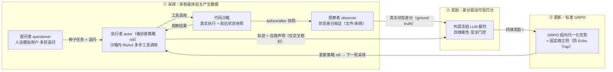
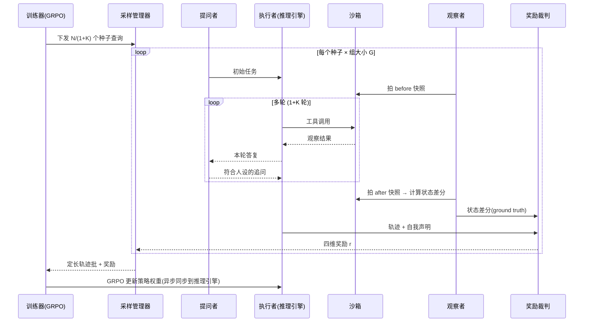
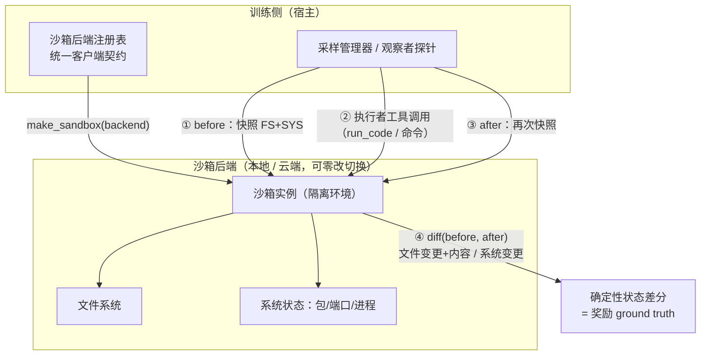

# 中国人民大学专业学位硕士研究生学位论文开题报告

> 说明：本文件按 RUC 苏州校区「附件1 开题报告模板」的小节顺序组织，供逐段复制进 Word 模板。三张流程图为 Mermaid 源码，可在支持 Mermaid 的编辑器中直接渲染后截图贴入，或按图注自行绘制。

---

## 论文题目

**面向自进化的智能体大语言模型强化学习系统研究**

（英文：Research on a Self-Evolving Reinforcement Learning System for Agentic Large Language Models）

## 研究方向

大语言模型智能体、强化学习系统

## 论文类型

☑ 新系统、新设备、新产品的研制与开发（系统研制报告）

## 主题词（不多于三个）

自进化强化学习系统；多智能体合成数据；差分驱动奖励

---

## 二、选题依据

### 1. 研究意义

大语言模型驱动的智能体已从单轮问答走向多步工具调用与环境交互，在代码沙箱、终端、文件系统等真实环境中通过"思考—调用工具—观察结果"的循环完成任务。要让这类交互式智能体持续变强，**强化学习**已成为主流手段——直接用交互轨迹上的奖励信号优化策略。

然而，把强化学习用于交互式智能体面临一个现实瓶颈：**它需要海量的交互轨迹与可信的奖励信号，而二者都难以靠人工规模化获得**。

- **数据侧**：真实用户回流数据积累慢、覆盖窄，无法及时、大规模地支撑强化学习所需的轨迹量；
- **奖励侧**：若依赖人工评分，成本高且无法持续；若让奖励只看智能体的**自我陈述**（"我已完成任务"），模型会迅速学会**谎报完成**这一典型的**奖励作弊（reward hacking）**行为——轨迹上写满"已成功创建文件"，而沙箱里根本没有那个文件。

因此本文要解决的**核心问题**是：**能否构建一套系统，让智能体在无人工标注的条件下，自主地产生经验、自主地获得可信奖励，从而自我进化？**

本文提出的**面向自进化的强化学习系统**通过三点回应这一问题：（1）用**多智能体协作**自主"造"出绝大部分训练数据（多智能体合成数据），摆脱对真实回流数据的依赖；（2）用**环境真实状态差分**而非智能体自述来锚定奖励，从取证机制上抑制奖励作弊；（3）把"采样—奖励—更新"闭环工程化为一套可持续运转的系统。

其价值在于：为交互式智能体的持续强化学习提供一条**低人工成本、抗奖励作弊、可工程落地**的数据与奖励供给路径。本文重点是**系统设计**而非算法最优——采用标准 GRPO 仅为证明整套系统的可行性。

### 2. 国内外研究现状分析

**（1）智能体的强化学习。** GRPO（Group Relative Policy Optimization）对同一查询的一组 rollout 做组内奖励归一化来估计优势、省去价值网络，是当前智能体强化学习的主力算法；近期工作从理论上揭示其方差缩减主要由每步 rollout 总数（查询数 × 组大小）驱动。多轮智能体强化学习则暴露出策略多样性坍缩的 Echo Trap 现象，需以熵正则预防。这些工作聚焦**算法**，对"训练数据与奖励如何低成本、可信地供给"着墨较少。

**（2）交互式智能体的经验采样。** 面向 GUI/数字环境的智能体工作在特定环境中通过强化微调采集与训练。这类采样多为**单轮**、且奖励常依赖环境内置信号或规则，难以推广到开放的工具使用任务，也未系统性解决多轮交互经验的自主生成。

**（3）奖励建模与奖励作弊。** 以大模型为裁判（LLM-as-a-judge）缓解了规则奖励覆盖面窄的问题，但若裁判看到的仍只是智能体**自述**的轨迹文本，奖励作弊空间依旧存在。如何让奖励**锚定环境真实状态**，是当前尚未被充分解决的问题。

**（4）强化学习训练框架。** verl（基于 HybridFlow）等框架支持推理与训练的灵活编排，为大规模智能体强化学习提供了工程底座，但采样与奖励的具体机制仍需在框架之上自行设计。

**发展趋势与本文定位**：现有工作在**算法**层面已较成熟，但在"**如何自主、可信地供给训练数据与奖励**"这一**系统与数据**层面仍有明显空白。本文正是面向这一空白，以多智能体合成数据 + 差分驱动奖励，构建一套自进化强化学习系统。

### 3. 主要参考文献

1. Shao Z., Wang P., Zhu Q., et al. DeepSeekMath: Pushing the Limits of Mathematical Reasoning in Open Language Models. arXiv:2402.03300, 2024.（GRPO 原始论文）
2. Wu Y., Ma L., Ding L., et al. It Takes Two: Your GRPO Is Secretly DPO. arXiv:2510.00977, 2025.
3. Wang Z., et al. Multi-Turn RL for LLM Agents: The Echo Trap. arXiv:2504.20073, 2025.
4. Lai S., et al. RFT Naturally Mitigates Forgetting in Continual Post-Training. arXiv:2507.05386, 2026.
5. Sheng G., Zhang C., Ye Z., et al. HybridFlow: A Flexible and Efficient RLHF Framework. arXiv:2409.19256, 2024.（verl 框架）
6. Rolnick D., et al. Experience Replay for Continual Learning. arXiv:1811.11682, 2019.

---

## 三、课题技术路线及研究方案

### 1. 主要研究内容

本文设计并实现一套面向自进化的智能体强化学习系统，主要研究内容分三部分：

**（1）多智能体采样架构（自主产生数据）。** 三个协同的智能体把"一次采样"变成"一段自主多轮交互经验"：

- **执行者（actor）**：即被训练的策略，在**代码沙箱**中以 ReAct 方式多步调用工具求解任务，产生交互轨迹；
- **观察者（observer）**：在轨迹执行**前后**对沙箱状态各拍一次快照，计算**状态差分**（文件系统变更及内容、系统状态变更），产出客观状态报告；
- **提问者（questioner）**：扮演**具人设**的模拟用户，在执行者每轮答复后生成符合人设的追问，把单个种子任务扩展为**多轮对话**。

由此，训练数据绝大部分并非来自真实用户回流，而是由**多智能体系统自主合成**。

**（2）差分驱动的可信奖励（自主产生奖励）。** 奖励不取自智能体自述，而由一个**外部冻结的大模型裁判**依据观察者提供的**环境真实状态差分**统一打分，四维度（完成度、正确性、轨迹质量、安全）乘性聚合、安全为二元门控。执行者的自我声明仅作交叉核对——当"声称写入 12345"而差分显示实为 99999 时，矛盾被直接暴露。

**（3）系统实现与端到端验证。** 以成熟强化学习框架为底座，将采样与奖励机制整合为完整系统，推理与训练异步分离；沙箱后端经统一契约抽象，本地/云端可零改切换。在 Qwen3.5-9B 上端到端验证：用**少量种子查询**、经多轮追问扩展，驱动起完整的强化学习训练。

### 2. 需要突破和解决的关键问题

- **K1 沙箱基建与取证**：搭建可复现、可取证的代码沙箱环境，并实现执行前后的**确定性状态差分**（含结构化文件内容抽取、系统状态快照）——这是抗奖励作弊的取证基础，也是本文工程工作量的核心。
- **K2 多轮采样与定长训练契约的耦合**：强化学习框架要求每步返回**定长**的轨迹批次，而多轮追问天然产生**变长**轨迹。需在"固定每步总轨迹预算"下，用 **1/(1+追问次数)** 的种子查询、以固定轮数追问补足总量，使多轮采样恰好契合定长契约。
- **K3 系统级稳定运转**：多智能体 + 沙箱 + 异步推理训练的链路长、故障点多，需保证端到端能稳定完成训练步（有效轨迹产出、奖励正常计算、策略更新不坍缩）。

### 3. 特色与创新之处

- **创新一（数据供给）：多智能体合成数据。** 训练数据绝大部分由多智能体系统自主生成，而非真实回流——以工程手段解决"强化学习数据难以规模化获得"的瓶颈。
- **创新二（奖励取证）：差分驱动的抗作弊奖励。** 奖励锚定于沙箱**真实状态差分**而非智能体自述，从**取证机制**上抑制奖励作弊，是与"仅看轨迹文本的 LLM 裁判"的关键区别。
- **创新三（系统工程）：完整自进化闭环的工程落地。** 把沙箱基建、多智能体协作、异步训练缝合为一套可持续运转的系统，并以"少量种子驱动完整 RL 训练"验证其可行性——**本文以系统设计与工程搭建为主要贡献，而非算法最优**。

> **本文如何体现沙箱基建与系统搭建的工作量与创新**：（i）自建可复现、可取证的沙箱环境与**确定性状态差分**取证层（K1）；（ii）打通多智能体协作、异步推理/训练、外部奖励裁判服务的**长链路系统集成**（K3）；（iii）解决多轮采样与定长训练契约的**工程耦合难题**（K2）。这些均属系统与基建层面的实质工作量，构成论文的主要创新载体。

### 4. 拟采取的研究/设计方法与技术路线

**总体技术路线（自进化闭环）：**

**图 1　自进化强化学习系统总闭环**：采样（多智能体协作产生多轮交互经验）→ 奖励（观察者状态差分驱动裁判打分）→ 更新（GRPO），策略更新后进入下一轮采样，形成无人工标注的自进化循环。

**训练/推理时序（一个训练步内部）：**

**图 2　训练/推理时序**：推理与训练异步分离；一个训练步内，种子经多轮追问扩展为多轮轨迹，观察者在收尾时以状态差分取证，裁判据此打分，训练器以定长批次做 GRPO 更新并将新权重同步回推理引擎。

**沙箱工作机制与状态差分取证：**

**图 3　沙箱工作机制与状态差分取证**：观察者以只读探针在执行前后对沙箱文件系统与系统状态各拍一次快照，作差得到**确定性**的状态差分，作为奖励的客观依据；沙箱后端经统一契约与注册表解耦，本地开发与云端生产零改切换。

**基座与训练配置**：基座 Qwen3.5-9B；策略优化标准 GRPO；推理与训练异步策略分离、BF16 全栈；奖励裁判以外部服务形式提供，开启思考模式并预留足够输出预算。

### 5. 实验方案的可行性分析

- **单元级已具备**：采样、观察者取证、奖励聚合、轨迹装配等模块以 CPU 单元测试覆盖，无 GPU 亦可验证逻辑正确。
- **系统级已打通关键环节**：多卡环境上已能完成模型加载、执行者/参考模型引擎初始化、奖励回路初始化，并在真实沙箱中运行多智能体会话、产出状态差分——完整训练步的链路已跑通至策略更新前的各环节。
- **规模可控**：正式训练仅 20 步，且每步用 1/(1+追问次数) 的种子查询，算力需求小，16 卡即可完成，可行性高。
- **风险与预案**：多轮追问链路若受工程约束暂未完全稳定，可退化为单轮采样的**等价总量**训练，系统其余部分（差分驱动奖励、GRPO 更新）不受影响，不阻塞主线验证。

> **备注（训练集，后续处理）**：当前训练数据沿用了旧版本按能力域组织的顺序与规模，其**数据顺序**是为早期方案设计的、**规模**也偏大。本文 step 数与每步数据量均已大幅缩减，训练集需相应精简；数据顺序对本文（非持续学习）不重要。此项不阻塞"先跑通"，列为后续优化。

---

## 四、工作进度安排

| 阶段 | 时间 | 内容 |
|------|------|------|
| 文献调研与选题 | 已完成 | 智能体强化学习、GRPO、奖励建模与奖励作弊、RL 训练框架调研 |
| 系统设计与实现 | 已完成 | 多智能体采样架构、差分驱动奖励、沙箱基建与状态差分取证、无侵入系统集成 |
| 单元与系统级验证 | 进行中 | CPU 单元测试；多卡端到端链路打通（采样→奖励→更新） |
| 正式训练与分析 | 进行中 | 16 卡 20 步训练；系统稳定性、抗作弊统计、训练前后表现对比 |
| 论文撰写与答辩 | 后续 | 补入实验结果，完成论文定稿与答辩 |

## 五、预期成果

1. 一套**面向自进化的智能体强化学习系统**：多智能体协作自主合成训练数据、差分驱动奖励、标准 GRPO 更新，端到端可运转。
2. 验证结论：用**少量种子查询**即可驱动完整强化学习训练；**多智能体协作 + 状态差分取证**能有效抑制奖励作弊；差分驱动奖励能为策略提供有效学习信号、**增强模型表现**。
3. 一篇硕士学位论文及相应系统研制报告。

## 六、审核意见

（由导师及培养单位填写）
