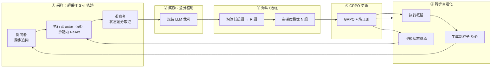

# 中国人民大学专业学位硕士研究生学位论文开题报告

---

## 论文题目

**面向智能体的大模型自进化强化学习系统研究与实现**

（英文：Research and Implementation of a Self-Evolving Reinforcement Learning System for Agentic Large Language Models）

## 研究方向

大语言模型智能体、强化学习系统

## 论文类型

☑ 新系统、新设备、新产品的研制与开发（系统研制报告）

## 主题词（不多于三个）

自进化强化学习系统；多智能体合成数据；差分驱动奖励

---

## 二、选题依据

### 1. 研究意义

强化学习是让交互式智能体持续变强的主流手段，但其落地受制于一个根本性约束：**训练数据与可信奖励均难以靠人工规模化获得**。真实用户回流数据积累慢、覆盖窄，无法及时支撑强化学习所需的轨迹量；而奖励若仅依赖智能体自述，模型会迅速学会谎报完成这一奖励作弊行为。这一"数据与奖励的供给瓶颈"是当前智能体强化学习走向实用化的核心障碍。

本文要解决的核心问题是：**能否让智能体在无人工标注条件下自主产生训练数据、自主获得可信奖励，从而自我进化？** 这一问题的解决具有明确的工程价值：它使交互式智能体的持续强化学习摆脱对人工标注的依赖，从"被动等待回流数据"转向"主动自主产生经验"，为智能体的持续进化提供一条可工程落地的路径。

本文提出的自进化强化学习系统通过**跨步自进化机制**解决这一问题：系统在每个训练步完成后，基于上一轮最优轨迹的执行概括与沙箱状态继承，自主生成下一轮训练任务——除初始种子外，后续所有训练查询由系统产生，形成无人工标注的自进化闭环。多智能体协作使数据产生过程自主化，环境状态差分使奖励锚定在真实变更而非智能体自述。这一设计的先进性在于：它不依赖任何外部数据源即可持续运转，且奖励取证机制从结构上抑制作弊，而非依赖事后过滤。

在技术层面，自进化场景对系统工程提出了更高要求：系统一旦启动便持续自主运转，无人工干预，任何环节的不稳定都会导致自进化过程中断甚至崩溃。因此，工程稳定性是本选题的首要技术难点，其工作量主要体现在两方面。

**其一，训练基建。** 自进化系统的持续运转依赖一套完整的训练基础设施：沙箱环境需具备跨训练步的状态继承能力，使智能体在上轮产出的文件基础上继续工作；执行前后的确定性状态差分需准确捕获文件内容与系统状态变更，为奖励提供可信取证；推理与训练需异步分离编排，权重更新后无缝同步回推理引擎；多智能体协作采样、超采样-淘汰-选组、跨步种子生成等环节需在强化学习框架的定长批次约束下无缝衔接。这些基建是自进化闭环得以物理运转的前提，链路长、集成度高，构成主要的工程工作量。

**其二，训练监控与防坍缩。** 自进化系统持续自主运转，无人值守，策略一旦发生模式坍缩或训练崩溃而不被及时检测，将导致后续所有训练步在无效信号上空转，自进化过程失效。因此需实时监控奖励标准差、优势方差、策略 KL 散度等指标，在坍缩或崩溃发生时自动终止训练，保证自进化过程的稳定性与可控性。

### 2. 国内外研究现状分析

自进化是当前人工智能领域的重点研究方向，而自进化训练——让模型通过强化学习等手段自主产生经验、自主优化策略——又是其中最受关注的方向之一，国内外研究机构与企业均在积极探索。

**（1）智能体强化学习算法。** GRPO（Group Relative Policy Optimization）对同一查询的一组 rollout 做组内奖励归一化来估计优势、省去价值网络，是当前智能体强化学习的主力算法。近期工作进一步从理论上揭示其方差缩减主要由每步 rollout 总数驱动，为通过扩大采样规模提升训练信号质量提供了依据。多轮智能体强化学习则暴露出策略多样性坍缩的 Echo Trap 现象，需以熵正则预防——这一发现表明，自进化训练过程中的稳定性监控不可或缺。

**（2）交互式智能体的经验采样。** 面向 GUI/数字环境的智能体工作在特定环境中通过强化微调采集与训练。这类采样多为单轮、且奖励常依赖环境内置信号或规则，难以推广到开放的工具使用任务，也未系统性解决多轮交互经验的自主生成。如何让智能体自主产生训练数据，而非依赖人工采集或环境内置信号，是自进化训练走向实用化的关键缺口。

**（3）奖励建模与奖励作弊。** 以大模型为裁判（LLM-as-a-judge）缓解了规则奖励覆盖面窄的问题，但若裁判看到的仍只是智能体自述的轨迹文本，奖励作弊空间依旧存在。如何让奖励锚定环境真实状态而非智能体叙事，是自进化训练中奖励可信化的核心问题，当前尚未被充分解决。

**（4）强化学习训练框架。** verl（基于 HybridFlow）等框架支持推理与训练的灵活编排，为大规模智能体强化学习提供了工程底座。但框架本身不提供数据自主产生、奖励可信取证、跨步状态继承等自进化所需的核心机制，这些需在框架之上自行设计与集成。

**发展趋势与本文定位**：现有工作在算法层面已较成熟，但在"如何自主、可信地供给训练数据与奖励，并使系统持续自进化运转"这一系统与数据层面仍有明显空白。本文正是面向这一空白，以多智能体合成数据、差分驱动奖励、跨步自进化闭环，构建一套自进化强化学习系统。

### 3. 主要参考文献

[1] Zhihong Shao, Peiyi Wang, Qihao Zhu, et al. DeepSeekMath: Pushing the Limits of Mathematical Reasoning in Open Language Models. arXiv:2402.03300, 2024.（GRPO 算法）

[2] Yihong Wu, Liheng Ma, Lei Ding, et al. It Takes Two: Your GRPO Is Secretly DPO. arXiv:2510.00977, 2025.（GRPO 理论分析）

[3] Zihan Wang, et al. Multi-Turn RL for LLM Agents: The Echo Trap. arXiv:2504.20073, 2025.（策略坍缩与防坍缩）

[4] Song Lai, et al. RFT Naturally Mitigates Forgetting in Continual Post-Training. arXiv:2507.05386, 2026.（自进化训练）

[5] Zixiang Chen, Yihe Deng, Huizhuo Yuan, et al. Self-Play Fine-Tuning Converts Weak Language Models to Strong Language Models. arXiv:2401.01335, 2024.（自进化）

[6] Guangming Sheng, Chi Zhang, Zilingfeng Ye, et al. HybridFlow: A Flexible and Efficient RLHF Framework. arXiv:2409.19256, 2024.（训练框架）

[7] Long Ouyang, et al. Training language models to follow instructions with human feedback. arXiv:2203.02155, 2022.（奖励建模与奖励作弊）

---

## 三、课题技术路线及研究方案

### 1. 主要研究内容

本文的重点研究内容是**跨步自进化机制**——使系统除初始种子外，自主产生所有后续训练任务。围绕这一重点，研究内容分为四部分：

**（1）跨步自进化闭环。** 每个训练步完成后，系统基于上一轮经验自主生成下一轮训练任务：观察者用 LLM 概括上轮最优轨迹的执行情况（避免直接沿用轨迹导致模型偏移），将上轮沙箱文件系统状态继承到新沙箱（使智能体在上轮产出基础上继续工作），提问者基于执行概括与当前沙箱状态生成符合人设的新种子。本轮种子数等于上一轮存活组数，超采样量随淘汰动态收缩。这一机制使系统不依赖任何外部数据源即可持续自进化。

**（2）多智能体自主数据产生。** 执行者在沙箱中以 ReAct 方式求解任务产生交互轨迹，观察者对沙箱前后状态作差得到确定性状态差分，提问者基于上轮经验生成下一轮种子。三者协作使训练数据的产生、取证、追问全部自主化，无需人工标注。

**（3）超采样-淘汰-选组与差分驱动奖励。** 推理阶段超采样 S×n 条轨迹，淘汰低质组后按优势强度选梯度最优的 N×n 条训练，以"多推理少训练"提升自进化效率。奖励由外部冻结裁判依据环境真实状态差分而非智能体自述打分，从取证机制上抑制奖励作弊。

**（4）失败案例驱动的评估器与基建自演化。** 系统在训练过程中持续收集失败案例（执行失败、奖励异常或状态差分与模型自述矛盾的轨迹），每累计 10 个训练步或攒够 20 个失败案例时触发一次演化：由大模型（而非规则程序）综合任务意图、轨迹与环境证据归因，区分模型问题与基建问题，分别热更新提示词（裁判/提问者/执行者）或动态扩展基建（注册工具/补依赖/修 harness）。这使系统的自进化从"任务与策略"扩展到"任务、策略、评估器、基建"四维。上述触发参数及各训练超参均以演示系统可运行性为目的设定，并非经调优的最优取值。

### 2. 需要突破和解决的难题或关键问题

**K1 训练基建。** 自进化系统持续自主运转，需构建完整的训练基础设施：沙箱环境需具备跨步状态继承能力，确定性状态差分需准确捕获文件内容与系统状态变更，推理与训练需异步分离编排，多智能体采样与超采样-淘汰-选组需在定长批次约束下无缝衔接。这些基建是自进化闭环物理运转的前提。

**K2 训练监控与防坍缩。** 自进化系统无人值守，策略一旦发生模式坍缩或训练崩溃而不被及时检测，将导致后续所有训练步在无效信号上空转。需实时监控奖励标准差、优势方差、策略 KL 散度等指标，在坍缩或崩溃时自动终止训练，保证自进化过程的稳定性与可控性。

**K3 评估器与基建的持续演化。** 现有自进化系统通常将评估器与基建视为固定组件，训练中暴露的系统性缺陷（裁判盲区、工具缺失、沙箱限制）无法自我修复，导致失败案例积累而无法被利用。需设计由大模型驱动的失败案例归因机制，实现提示词与基建的周期性演化，使评估器与工具集随训练不断完善。

### 3. 特色与创新之处

与同类系统相比，本文的亮点在于：

**（1）真正的自进化。** 现有智能体 RL 系统依赖固定数据集或人工采集轨迹，训练任务由外部供给。本文系统除初始种子外，后续所有训练任务由系统基于上一轮执行经验自主生成（执行概括→沙箱状态继承→种子生成），形成不依赖外部数据的自进化闭环。

**（2）差分驱动的抗作弊奖励。** 现有 LLM-as-a-judge 方案让裁判看智能体自述的轨迹文本，奖励作弊空间依旧存在。本文让裁判依据沙箱真实状态差分打分，奖励锚定在环境客观变更而非智能体叙事，从取证机制上抑制作弊。

**（3）超采样-淘汰-选组的采样-训练解耦。** 推理超采样、淘汰低质组、选梯度最优组训练，以"多推理少训练"提升每步训练信号质量，同时通过淘汰动态收缩超采样量，使自进化过程逐步聚焦于高质量经验。

**（4）失败案例驱动的四维自进化。** 现有系统仅演化策略与任务，评估器与基建始终固定。本文以失败案例为驱动，由大模型归因后分别演化提示词（评估器维度）与基建（工具集维度），将自进化扩展至"任务、策略、评估器、基建"四维，使系统能自主修复训练中暴露的系统性缺陷。

### 4. 拟采取的研究方法设计方法，技术路线

**图 1　自进化强化学习系统总闭环**：采样→奖励→淘汰+选组→GRPO 更新→跨步自进化（执行概括+沙箱继承+新种子），形成无人工标注的自进化循环。第一步 S=2N，后续步 S=R。

基座 Qwen3.5-9B，策略优化标准 GRPO，推理与训练异步分离，训练步数由终止判据决定。

### 5. 实验方案的可行性分析

各模块（采样、观察者取证、奖励聚合、选组逻辑、跨步种子生成）均有单元测试覆盖。多卡环境上端到端链路已打通，覆盖采样→奖励→淘汰→选组→GRPO 更新→跨步种子生成的完整闭环。沙箱状态跨步继承在真实沙箱上验证通过。正式训练步数由终止判据决定，算力需求小，16 卡即可完成。

---

## 四、工作进度安排

**文献调研与选题**（已完成）：调研智能体强化学习、GRPO 算法、奖励建模与奖励作弊、策略坍缩与防坍缩、自进化训练等方向的国内外研究现状，确定选题。

**系统设计与实现**（已完成）：完成多智能体采样架构、超采样-淘汰-选组机制、差分驱动奖励、沙箱基建与状态差分取证、跨步自进化闭环（执行概括+沙箱状态继承+种子生成）的设计与实现。

**单元与系统级验证**（已完成）：单元测试覆盖采样、观察者取证、奖励聚合、选组逻辑、跨步种子生成等模块；多卡环境端到端链路打通，覆盖采样→奖励→淘汰→选组→GRPO 更新→跨步种子生成的完整闭环；沙箱状态跨步继承在真实沙箱上验证通过。

**正式训练与分析**（进行中）：在 16 卡上进行正式训练，训练步数由终止判据决定；分析系统稳定性、抗作弊效果、训练前后模型表现对比。

**论文撰写与答辩**（后续）：补入实验结果，完成论文定稿与答辩。

## 五、预期成果

1. 一套**面向自进化的智能体强化学习系统**：多智能体协作自主合成训练数据、超采样-淘汰-选组、差分驱动奖励、跨步状态继承与自进化、失败案例驱动的评估器与基建自演化、标准 GRPO 更新，端到端可运转。
2. 验证结论：用少量种子查询即可驱动完整强化学习训练；多智能体协作与状态差分取证能有效抑制奖励作弊；超采样-淘汰-选组能提升每步训练信号质量；跨步自进化使系统除初始种子外不依赖外部数据；失败案例自演化使评估器与基建能随训练自主完善。
3. 一篇硕士学位论文及相应系统研制报告。

## 六、审核意见

（由导师及培养单位填写）
